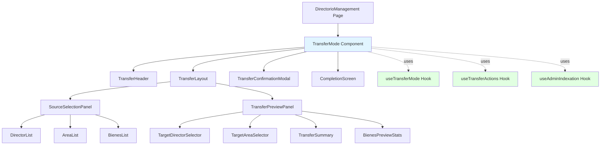
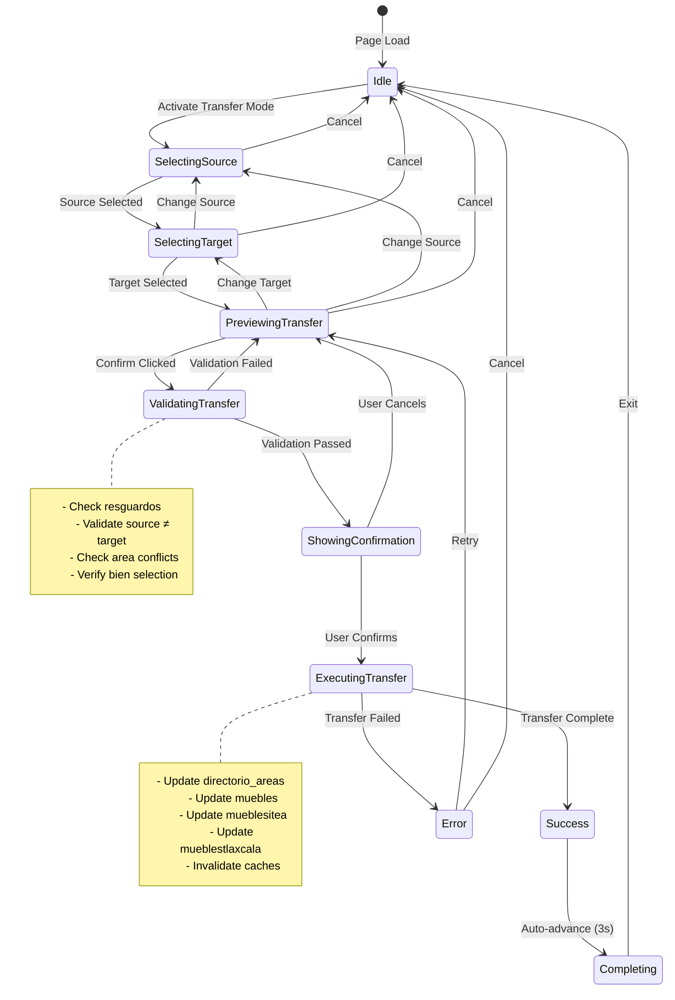
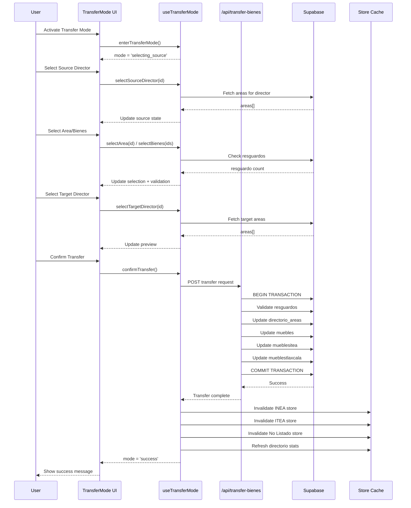

# Design Document: Asset Transfer Feature

## Overview

The Asset Transfer feature enables administrators to transfer areas and their associated assets (bienes) from one director to another through an interactive two-panel interface. This feature addresses organizational changes where asset responsibility needs to be reassigned while maintaining data integrity across three separate asset tables (INEA, ITEA, and No Listado).

The system follows the same UX patterns as the Inconsistency Resolver, providing a familiar and intuitive experience for administrators. The feature supports two transfer modes:

1. **Complete Area Transfer**: Moves an entire area with all its bienes to a target director
2. **Partial Bienes Transfer**: Moves selected bienes from a source area to an existing target director area

Key design principles:
- Atomic operations with full rollback support
- Real-time preview of transfer impact
- Validation to prevent invalid transfers
- Integration with existing store infrastructure
- Consistent UI patterns with existing features

## Architecture

### System Context

```mermaid
graph TB
    subgraph "Client Layer"
        UI[Transfer Mode UI]
        Hooks[State Management Hooks]
        Stores[Zustand Stores]
    end
    
    subgraph "API Layer"
        API[/api/admin/directorio/transfer-bienes]
        Auth[Authorization Middleware]
    end
    
    subgraph "Database Layer"
        DA[directorio_areas]
        DIR[directorio]
        AREA[area]
        INEA[muebles]
        ITEA[mueblesitea]
        NL[mueblestlaxcala]
        RES[resguardos]
    end
    
    UI --> Hooks
    Hooks --> Stores
    Hooks --> API
    API --> Auth
    Auth --> DA
    Auth --> INEA
    Auth --> ITEA
    Auth --> NL
    API -.reads.-> RES
    API -.reads.-> DIR
    API -.reads.-> AREA
    
    style UI fill:#e1f5ff
    style API fill:#fff4e1
    style DA fill:#ffe1e1
    style INEA fill:#ffe1e1
    style ITEA fill:#ffe1e1
    style NL fill:#ffe1e1
```

### Component Hierarchy



### State Machine



### Data Flow



## Components and Interfaces

### TransferMode Component

Main orchestrator component that manages the transfer workflow.

```typescript
interface TransferModeProps {
  onExit: () => void;
}

interface TransferModeState {
  mode: TransferMode;
  sourceDirector: Directorio | null;
  targetDirector: Directorio | null;
  selectedAreas: number[];
  selectedBienes: SelectedBien[];
  transferType: 'complete_area' | 'partial_bienes' | null;
  targetAreaId: number | null;
  showConfirmation: boolean;
  isExecuting: boolean;
  error: string | null;
}

type TransferMode = 
  | 'idle'
  | 'selecting_source'
  | 'selecting_target'
  | 'previewing'
  | 'validating'
  | 'confirming'
  | 'executing'
  | 'success'
  | 'error'
  | 'completing';
```

### useTransferMode Hook

State management hook following the pattern of `useInconsistencyResolver`.

```typescript
interface UseTransferModeReturn {
  // State
  mode: TransferMode;
  sourceDirector: Directorio | null;
  targetDirector: Directorio | null;
  selectedAreas: Area[];
  selectedBienes: Bien[];
  transferType: 'complete_area' | 'partial_bienes' | null;
  targetAreaId: number | null;
  validationErrors: ValidationError[];
  
  // Preview data
  previewData: TransferPreview | null;
  
  // Actions
  enterTransferMode: () => void;
  exitTransferMode: () => void;
  selectSourceDirector: (directorId: number) => void;
  selectTargetDirector: (directorId: number) => void;
  selectArea: (areaId: number) => void;
  deselectArea: (areaId: number) => void;
  selectBienes: (bienIds: number[]) => void;
  deselectBienes: (bienIds: number[]) => void;
  selectTargetArea: (areaId: number) => void;
  validateTransfer: () => Promise<boolean>;
  confirmTransfer: () => void;
  cancelTransfer: () => void;
}

interface TransferPreview {
  sourceDirector: Directorio & { areas: Area[] };
  targetDirector: Directorio & { areas: Area[] };
  bienesToTransfer: BienPreview[];
  totalCount: number;
  totalValue: number;
  affectedResguardos: number;
  transferType: 'complete_area' | 'partial_bienes';
  targetArea?: Area;
}

interface BienPreview {
  id: number;
  id_inv: string;
  descripcion: string;
  valor: number;
  source: 'inea' | 'itea' | 'no_listado';
  area: string;
}

interface ValidationError {
  type: 'resguardos' | 'duplicate_area' | 'same_director' | 'no_selection' | 'no_target_area';
  message: string;
  details?: any;
}
```

### useTransferActions Hook

API interaction hook for executing transfer operations.

```typescript
interface UseTransferActionsReturn {
  transferCompleteArea: (
    sourceDirectorId: number,
    targetDirectorId: number,
    areaId: number
  ) => Promise<TransferResult>;
  
  transferPartialBienes: (
    sourceDirectorId: number,
    targetDirectorId: number,
    targetAreaId: number,
    bienIds: { inea: number[]; itea: number[]; no_listado: number[] }
  ) => Promise<TransferResult>;
  
  checkResguardos: (areaId: number) => Promise<number>;
  
  isExecuting: boolean;
  error: string | null;
}

interface TransferResult {
  success: boolean;
  message: string;
  bienesTransferred: number;
  areasUpdated: number;
}
```

### TransferLayout Component

Two-panel layout component similar to `ResolverLayout`.

```typescript
interface TransferLayoutProps {
  leftPanel: React.ReactNode;
  rightPanel: React.ReactNode;
}
```

### SourceSelectionPanel Component

Left panel for selecting source director and areas/bienes.

```typescript
interface SourceSelectionPanelProps {
  directors: Directorio[];
  selectedDirector: Directorio | null;
  selectedAreas: number[];
  selectedBienes: number[];
  onSelectDirector: (directorId: number) => void;
  onSelectArea: (areaId: number) => void;
  onDeselectArea: (areaId: number) => void;
  onSelectBienes: (bienIds: number[]) => void;
  onDeselectBienes: (bienIds: number[]) => void;
}
```

### TransferPreviewPanel Component

Right panel showing real-time preview of transfer.

```typescript
interface TransferPreviewPanelProps {
  preview: TransferPreview | null;
  targetDirectors: Directorio[];
  selectedTargetDirector: Directorio | null;
  targetAreas: Area[];
  selectedTargetArea: number | null;
  onSelectTargetDirector: (directorId: number) => void;
  onSelectTargetArea: (areaId: number) => void;
  onConfirm: () => void;
  isValidating: boolean;
  validationErrors: ValidationError[];
}
```

### TransferConfirmationModal Component

Final confirmation modal before executing transfer.

```typescript
interface TransferConfirmationModalProps {
  show: boolean;
  preview: TransferPreview;
  onConfirm: () => Promise<void>;
  onCancel: () => void;
  isExecuting: boolean;
  error: string | null;
}
```

## Data Models

### Database Tables Involved

```typescript
// directorio_areas (many-to-many relationship)
interface DirectorioArea {
  id_directorio: number;
  id_area: number;
}

// muebles (INEA assets)
interface Mueble {
  id: number;
  id_inv: string;
  id_directorio: number;
  id_area: number;
  descripcion: string;
  valor: number;
  // ... other fields
}

// mueblesitea (ITEA assets)
interface MuebleItea {
  id: number;
  id_inv: string;
  id_directorio: number;
  id_area: number;
  descripcion: string;
  valor: number;
  // ... other fields
}

// mueblestlaxcala (No Listado assets)
interface MuebleTlaxcala {
  id: number;
  id_inv: string;
  id_directorio: number;
  id_area: number;
  descripcion: string;
  valor: number;
  // ... other fields
}

// resguardos (custody records - read only for validation)
interface Resguardo {
  id: number;
  id_directorio: number;
  id_area: number;
  activo: boolean;
  // ... other fields
}
```

### Transfer Request Payload

```typescript
interface TransferRequest {
  action: 'transfer_complete_area' | 'transfer_partial_bienes';
  sourceDirectorId: number;
  targetDirectorId: number;
  areaId?: number; // For complete area transfer
  targetAreaId?: number; // For partial bienes transfer
  bienIds?: {
    inea: number[];
    itea: number[];
    no_listado: number[];
  }; // For partial bienes transfer
}
```

### Transfer Response

```typescript
interface TransferResponse {
  success: boolean;
  message: string;
  data?: {
    bienesTransferred: number;
    areasUpdated: number;
    ineaUpdated: number;
    iteaUpdated: number;
    noListadoUpdated: number;
  };
  error?: string;
}
```


## Correctness Properties

*A property is a characteristic or behavior that should hold true across all valid executions of a system—essentially, a formal statement about what the system should do. Properties serve as the bridge between human-readable specifications and machine-verifiable correctness guarantees.*

### Property Reflection

After analyzing all acceptance criteria, I identified several areas of redundancy:

1. **Transaction Atomicity**: Requirements 8.7, 9.5, and 16.1 all specify rollback on failure - these can be combined into a single comprehensive property
2. **Cache Invalidation**: Requirements 8.8, 9.6, and 11.1-11.4 all specify cache updates after transfers - these can be combined
3. **Authorization**: Requirements 1.3, 12.2, and 12.3 all specify authorization checks - these can be combined
4. **Logging**: Requirements 10.6, 12.4, and 16.5 all specify logging - these can be combined into a comprehensive logging property
5. **Preview Data Completeness**: Requirements 5.2-5.7 all specify different fields in the preview - these can be combined into a single property about required fields
6. **Database Updates**: Requirements 8.3-8.6 all specify updates to different tables - these can be combined into a single property about multi-table updates

### Property 1: Authorization Enforcement

*For any* transfer operation attempt, the system should only allow execution if the requesting user has admin or superadmin role, and should reject all other attempts with an authorization error.

**Validates: Requirements 1.3, 12.2, 12.3**

### Property 2: Source-Target Validation

*For any* transfer operation, the source director must not equal the target director, otherwise the system should reject the transfer with a validation error.

**Validates: Requirements 14.1**

### Property 3: Resguardo Blocking

*For any* area selected for transfer, if active resguardos exist in that area, then the system should block the transfer operation and display an error message with the resguardo count.

**Validates: Requirements 3.1, 3.2, 3.3, 14.3**

### Property 4: Resguardo Count Display

*For any* area displayed in the source selection panel, the system should show the count of active resguardos associated with that area.

**Validates: Requirements 2.5, 3.4**

### Property 5: Director Filtering

*For any* target director selection list, the system should exclude the currently selected source director from the available options.

**Validates: Requirements 4.2**

### Property 6: Duplicate Area Prevention

*For any* complete area transfer, if the target director already has the area assigned, then the system should reject the transfer and display an error message directing the user to the Inconsistency Resolver.

**Validates: Requirements 4.4, 4.5, 14.4**

### Property 7: Multi-Area Partial Transfer Prevention

*For any* partial bienes selection, if bienes are selected from multiple different areas, then the system should reject the selection and only allow bienes from a single area.

**Validates: Requirements 2.7**

### Property 8: Target Area Requirement

*For any* partial bienes transfer, the system should require selection of a target area before enabling the confirmation button, and should reject transfers without a target area.

**Validates: Requirements 6.2, 14.5**

### Property 9: Selection Requirement

*For any* transfer operation, the system should require at least one bien or area to be selected, and should reject transfers with no selection.

**Validates: Requirements 14.2**

### Property 10: Preview Data Completeness

*For any* transfer preview display, the system should include all required fields: source director details (name, areas), target director details (name, areas), complete list of bienes, total count, total value, and resguardo count.

**Validates: Requirements 5.1, 5.2, 5.3, 5.4, 5.5, 5.6, 5.7**

### Property 11: Preview Real-Time Updates

*For any* change in source selection, target selection, or area selection, the transfer preview should update to reflect the new state.

**Validates: Requirements 4.3, 5.1, 6.4**

### Property 12: Target Area Data Display

*For any* target area option displayed during partial bienes transfer, the system should show the area name and the count of bienes currently in that area.

**Validates: Requirements 6.3**

### Property 13: Complete Area Transfer Database Operations

*For any* complete area transfer execution, the system should: (1) delete the directorio_areas relationship for the source director, (2) create a new directorio_areas relationship for the target director, (3) update id_directorio and id_area fields for all bienes in all three tables (muebles, mueblesitea, mueblestlaxcala) that belong to the transferred area.

**Validates: Requirements 8.1, 8.2, 8.3, 8.4, 8.5, 8.6**

### Property 14: Partial Bienes Transfer Database Operations

*For any* partial bienes transfer execution, the system should: (1) update id_directorio to the target director for selected bienes only, (2) update id_area to the target area for selected bienes only, (3) maintain the directorio_areas relationship for the source director, (4) update bienes across all three tables based on their source.

**Validates: Requirements 9.1, 9.2, 9.3, 9.4**

### Property 15: Transaction Atomicity

*For any* transfer operation, if any database operation fails during execution, then the system should rollback all changes to restore the database to its pre-transfer state.

**Validates: Requirements 8.7, 9.5, 16.1**

### Property 16: Cache Invalidation

*For any* successful transfer operation, the system should invalidate cache entries for INEA store, ITEA store, No Listado store, and directorio statistics to ensure the UI reflects updated data.

**Validates: Requirements 8.8, 9.6, 11.1, 11.2, 11.3, 11.4**

### Property 17: Operation Logging

*For any* transfer operation attempt (successful or failed), the system should log the operation with timestamp, user identity, source director, target director, bien count, and operation result.

**Validates: Requirements 10.6, 12.4**

### Property 18: Rollback Logging

*For any* transfer rollback operation, the system should log the rollback with failure details and error information.

**Validates: Requirements 16.5**

### Property 19: Input Validation

*For any* transfer API request, the system should validate all input parameters (source director ID, target director ID, area IDs, bien IDs) before executing any database operations.

**Validates: Requirements 12.5**

### Property 20: Processing UI State

*For any* transfer operation in progress, the system should display a processing indicator and disable all interactive controls until the operation completes.

**Validates: Requirements 10.1, 10.2**

### Property 21: Success Feedback

*For any* successful transfer operation, the system should display a success message with a summary including the count of bienes transferred.

**Validates: Requirements 10.3**

### Property 22: Error Feedback

*For any* failed transfer operation, the system should display an error message with specific details about the failure cause.

**Validates: Requirements 10.4**

### Property 23: Validation Error Specificity

*For any* validation failure, the system should display a specific error message that identifies which validation rule failed.

**Validates: Requirements 14.6**

### Property 24: Progress Indicator for Large Transfers

*For any* transfer operation with more than 100 bienes, the system should display a progress indicator showing transfer progress.

**Validates: Requirements 15.2**

### Property 25: Batch Progress Updates

*For any* transfer operation processed in batches, the system should update the progress indicator after each batch completes.

**Validates: Requirements 15.4**

### Property 26: Completion Before Feedback

*For any* transfer operation processed in batches, the system should complete all batches before displaying the final success confirmation.

**Validates: Requirements 15.5**

### Property 27: Rollback Error Handling

*For any* rollback operation that fails, the system should log the critical error and display a critical error message to the user.

**Validates: Requirements 16.3**

### Property 28: UI State Restoration on Rollback

*For any* transfer that is rolled back, the system should restore the UI to the pre-transfer state with all selections cleared.

**Validates: Requirements 16.4**

### Property 29: Transfer Mode Round Trip

*For any* transfer mode activation and exit sequence, the system should restore the standard directorio page view without any residual transfer mode state.

**Validates: Requirements 1.5**

### Property 30: Confirmation Modal Data Completeness

*For any* confirmation modal display, the modal should include all transfer preview information (source, target, bienes, counts, values).

**Validates: Requirements 7.3**

### Property 31: Confirmation Execution

*For any* user confirmation in the confirmation modal, the system should execute the transfer operation.

**Validates: Requirements 7.5**

### Property 32: Cancellation State Restoration

*For any* user cancellation in the confirmation modal, the system should return to the preview state without executing any database changes.

**Validates: Requirements 7.6**

### Property 33: Director Area Display

*For any* selected source director, the system should display all areas currently assigned to that director.

**Validates: Requirements 2.3**

### Property 34: Resguardo Resolution Auto-Enable

*For any* area with active resguardos that are subsequently resolved, the system should automatically enable the transfer operation for that area.

**Validates: Requirements 3.5**

### Property 35: Confirmation Button State

*For any* transfer preview state, the confirmation button should only be enabled when all required selections are complete and all validations pass.

**Validates: Requirements 7.1**

### Property 36: Confirmation Modal Display

*For any* confirmation button click when enabled, the system should display the final confirmation modal.

**Validates: Requirements 7.2**

## Error Handling

### Validation Errors

The system implements comprehensive validation before executing any transfer operation:

1. **Authorization Validation**
   - Check user role (admin or superadmin)
   - Return 403 Forbidden for unauthorized users
   - Log unauthorized attempts

2. **Input Validation**
   - Validate all IDs are positive integers
   - Verify source and target directors exist
   - Verify areas and bienes exist
   - Return 400 Bad Request for invalid inputs

3. **Business Rule Validation**
   - Source director ≠ Target director
   - No active resguardos in selected areas
   - Target director doesn't have area (for complete transfer)
   - Target area selected (for partial transfer)
   - At least one bien/area selected
   - Return 422 Unprocessable Entity for business rule violations

### Database Errors

All database operations are wrapped in transactions:

```typescript
try {
  await supabaseAdmin.rpc('begin_transaction');
  
  // Perform all database operations
  await updateDirectorioAreas();
  await updateMuebles();
  await updateMueblesItea();
  await updateMueblesTlaxcala();
  
  await supabaseAdmin.rpc('commit_transaction');
} catch (error) {
  await supabaseAdmin.rpc('rollback_transaction');
  
  // Log error with full context
  console.error('[TRANSFER_ERROR]', {
    timestamp: new Date().toISOString(),
    user: userId,
    source: sourceDirectorId,
    target: targetDirectorId,
    error: error.message,
    stack: error.stack
  });
  
  // Return user-friendly error
  return {
    success: false,
    error: 'Transfer failed. All changes have been rolled back.'
  };
}
```

### Rollback Failure Handling

In the rare case where rollback itself fails:

1. Log critical error with full context
2. Display critical error message to user
3. Recommend manual database verification
4. Send alert to system administrators
5. Lock the affected records for manual review

### Network Errors

Handle network failures gracefully:

1. Implement retry logic (3 attempts with exponential backoff)
2. Display clear error messages
3. Allow user to retry operation
4. Preserve user selections during retry

### Cache Invalidation Errors

If cache invalidation fails after successful transfer:

1. Log warning (not critical since transfer succeeded)
2. Continue with success flow
3. Cache will be refreshed on next page load
4. Background job can force refresh if needed

## Testing Strategy

### Dual Testing Approach

The testing strategy combines unit tests and property-based tests for comprehensive coverage:

**Unit Tests**: Focus on specific examples, edge cases, and integration points
- Specific transfer scenarios (1 bien, 10 bienes, 100 bienes)
- Edge cases (empty selections, invalid IDs, missing data)
- Error conditions (network failures, database errors, authorization failures)
- UI component rendering and interactions
- Modal flows and state transitions

**Property-Based Tests**: Verify universal properties across all inputs
- Authorization enforcement across all user roles
- Validation rules across all input combinations
- Database atomicity across all transfer sizes
- Cache invalidation across all transfer types
- Logging completeness across all operations

### Property-Based Testing Configuration

**Library**: Use `fast-check` for TypeScript/JavaScript property-based testing

**Configuration**:
- Minimum 100 iterations per property test
- Seed-based reproducibility for failed tests
- Shrinking enabled to find minimal failing cases
- Timeout: 30 seconds per property test

**Test Tagging Format**:
```typescript
describe('Feature: directorio-bienes-transfer, Property 1: Authorization Enforcement', () => {
  it('should only allow admin/superadmin users to execute transfers', () => {
    fc.assert(
      fc.property(
        fc.record({
          user: fc.record({
            role: fc.constantFrom('user', 'admin', 'superadmin', 'guest')
          }),
          transfer: fc.record({
            sourceDirectorId: fc.integer({ min: 1, max: 1000 }),
            targetDirectorId: fc.integer({ min: 1, max: 1000 })
          })
        }),
        async ({ user, transfer }) => {
          const result = await executeTransfer(user, transfer);
          
          if (user.role === 'admin' || user.role === 'superadmin') {
            // Should proceed to validation (may fail for other reasons)
            expect(result.error).not.toBe('Unauthorized');
          } else {
            // Should be rejected with authorization error
            expect(result.success).toBe(false);
            expect(result.error).toContain('Unauthorized');
          }
        }
      ),
      { numRuns: 100 }
    );
  });
});
```

### Unit Test Examples

**Example 1: Complete Area Transfer**
```typescript
describe('Complete Area Transfer', () => {
  it('should transfer area with all bienes to target director', async () => {
    // Setup
    const sourceDirector = await createTestDirector('Source');
    const targetDirector = await createTestDirector('Target');
    const area = await createTestArea('Test Area');
    await assignAreaToDirector(area.id, sourceDirector.id);
    
    const bienes = await createTestBienes(area.id, sourceDirector.id, 5);
    
    // Execute
    const result = await transferCompleteArea(
      sourceDirector.id,
      targetDirector.id,
      area.id
    );
    
    // Verify
    expect(result.success).toBe(true);
    expect(result.bienesTransferred).toBe(5);
    
    // Verify database state
    const areaRelation = await getDirectorioArea(area.id);
    expect(areaRelation.id_directorio).toBe(targetDirector.id);
    
    const updatedBienes = await getBienesByArea(area.id);
    updatedBienes.forEach(bien => {
      expect(bien.id_directorio).toBe(targetDirector.id);
    });
  });
});
```

**Example 2: Resguardo Blocking**
```typescript
describe('Resguardo Validation', () => {
  it('should block transfer when active resguardos exist', async () => {
    // Setup
    const sourceDirector = await createTestDirector('Source');
    const targetDirector = await createTestDirector('Target');
    const area = await createTestArea('Test Area');
    await assignAreaToDirector(area.id, sourceDirector.id);
    
    // Create active resguardo
    await createTestResguardo(area.id, sourceDirector.id, { activo: true });
    
    // Execute
    const result = await transferCompleteArea(
      sourceDirector.id,
      targetDirector.id,
      area.id
    );
    
    // Verify
    expect(result.success).toBe(false);
    expect(result.error).toContain('resguardo');
    expect(result.error).toContain('1'); // Count of resguardos
  });
});
```

**Example 3: Transaction Rollback**
```typescript
describe('Transaction Rollback', () => {
  it('should rollback all changes if any operation fails', async () => {
    // Setup
    const sourceDirector = await createTestDirector('Source');
    const targetDirector = await createTestDirector('Target');
    const area = await createTestArea('Test Area');
    await assignAreaToDirector(area.id, sourceDirector.id);
    
    const bienes = await createTestBienes(area.id, sourceDirector.id, 3);
    
    // Mock a failure in the middle of the operation
    jest.spyOn(supabaseAdmin, 'from').mockImplementationOnce(() => {
      throw new Error('Database error');
    });
    
    // Execute
    const result = await transferCompleteArea(
      sourceDirector.id,
      targetDirector.id,
      area.id
    );
    
    // Verify
    expect(result.success).toBe(false);
    
    // Verify database state is unchanged
    const areaRelation = await getDirectorioArea(area.id);
    expect(areaRelation.id_directorio).toBe(sourceDirector.id);
    
    const unchangedBienes = await getBienesByArea(area.id);
    unchangedBienes.forEach(bien => {
      expect(bien.id_directorio).toBe(sourceDirector.id);
    });
  });
});
```

### Integration Tests

Test the complete flow from UI to database:

1. **Happy Path Integration Test**
   - Activate transfer mode
   - Select source director and area
   - Select target director
   - Confirm transfer
   - Verify database updates
   - Verify cache invalidation
   - Verify UI updates

2. **Error Recovery Integration Test**
   - Start transfer operation
   - Simulate database failure
   - Verify rollback
   - Verify UI error display
   - Verify user can retry

3. **Multi-Table Integration Test**
   - Create bienes in all three tables
   - Execute transfer
   - Verify all tables updated correctly
   - Verify referential integrity maintained

### Performance Tests

Test system behavior under load:

1. **Large Transfer Test**
   - Transfer 1000+ bienes
   - Verify batch processing
   - Verify progress updates
   - Verify completion time < 30 seconds

2. **Concurrent Transfer Test**
   - Simulate multiple simultaneous transfers
   - Verify transaction isolation
   - Verify no data corruption

3. **Cache Performance Test**
   - Execute transfer
   - Measure cache invalidation time
   - Verify UI refresh time < 1 second


## API Specifications

### Endpoint: `/api/admin/directorio/transfer-bienes`

**Method**: POST

**Authentication**: Required (admin or superadmin role)

**Authorization**: Service role key for database operations

#### Request Body

```typescript
interface TransferBienesRequest {
  action: 'transfer_complete_area' | 'transfer_partial_bienes';
  sourceDirectorId: number;
  targetDirectorId: number;
  
  // For complete area transfer
  areaId?: number;
  
  // For partial bienes transfer
  targetAreaId?: number;
  bienIds?: {
    inea: number[];
    itea: number[];
    no_listado: number[];
  };
}
```

#### Response Body

**Success Response (200)**:
```typescript
interface TransferBienesSuccessResponse {
  success: true;
  message: string;
  data: {
    bienesTransferred: number;
    areasUpdated: number;
    ineaUpdated: number;
    iteaUpdated: number;
    noListadoUpdated: number;
  };
}
```

**Error Responses**:

**400 Bad Request** - Invalid input parameters
```typescript
interface TransferBienesErrorResponse {
  success: false;
  error: string;
  details?: {
    field: string;
    issue: string;
  }[];
}
```

**403 Forbidden** - Unauthorized user
```typescript
interface TransferBienesErrorResponse {
  success: false;
  error: 'Unauthorized: Admin or superadmin role required';
}
```

**422 Unprocessable Entity** - Business rule violation
```typescript
interface TransferBienesErrorResponse {
  success: false;
  error: string;
  validationErrors: {
    type: 'resguardos' | 'duplicate_area' | 'same_director' | 'no_selection';
    message: string;
    details?: any;
  }[];
}
```

**500 Internal Server Error** - Database or system error
```typescript
interface TransferBienesErrorResponse {
  success: false;
  error: string;
  rollback: boolean;
}
```

#### API Implementation Flow

```typescript
export async function POST(request: NextRequest) {
  const logPrefix = '[API:TRANSFER_BIENES]';
  console.log(`${logPrefix} ========================================`);
  console.log(`${logPrefix} Nueva solicitud de transferencia`);

  try {
    // STEP 1: Validate user authorization
    const user = await validateUser(request);
    if (!['admin', 'superadmin'].includes(user.role)) {
      return NextResponse.json(
        { success: false, error: 'Unauthorized: Admin or superadmin role required' },
        { status: 403 }
      );
    }

    // STEP 2: Parse and validate request body
    const body = await request.json();
    const validationResult = validateTransferRequest(body);
    if (!validationResult.valid) {
      return NextResponse.json(
        { success: false, error: 'Invalid request', details: validationResult.errors },
        { status: 400 }
      );
    }

    const { action, sourceDirectorId, targetDirectorId } = body;

    // STEP 3: Validate business rules
    const businessValidation = await validateBusinessRules(body);
    if (!businessValidation.valid) {
      return NextResponse.json(
        { 
          success: false, 
          error: 'Validation failed', 
          validationErrors: businessValidation.errors 
        },
        { status: 422 }
      );
    }

    // STEP 4: Execute transfer based on action
    let result;
    if (action === 'transfer_complete_area') {
      result = await handleCompleteAreaTransfer(body);
    } else {
      result = await handlePartialBienesTransfer(body);
    }

    // STEP 5: Log successful operation
    await logTransferOperation({
      timestamp: new Date().toISOString(),
      userId: user.id,
      action,
      sourceDirectorId,
      targetDirectorId,
      bienesTransferred: result.data.bienesTransferred,
      success: true
    });

    console.log(`${logPrefix} ✅ Transferencia completada exitosamente`);
    console.log(`${logPrefix} ========================================`);

    return NextResponse.json(result);

  } catch (error) {
    console.error(`${logPrefix} ❌❌❌ ERROR CRÍTICO ❌❌❌`);
    console.error(`${logPrefix} Error:`, error);
    console.error(`${logPrefix} ========================================`);

    // Log failed operation
    await logTransferOperation({
      timestamp: new Date().toISOString(),
      action: body?.action,
      sourceDirectorId: body?.sourceDirectorId,
      targetDirectorId: body?.targetDirectorId,
      success: false,
      error: error instanceof Error ? error.message : 'Unknown error'
    });

    return NextResponse.json(
      { 
        success: false, 
        error: error instanceof Error ? error.message : 'Unknown error',
        rollback: true
      },
      { status: 500 }
    );
  }
}
```

#### Complete Area Transfer Handler

```typescript
async function handleCompleteAreaTransfer(request: TransferBienesRequest) {
  const logPrefix = '[TRANSFER:COMPLETE_AREA]';
  const { sourceDirectorId, targetDirectorId, areaId } = request;

  console.log(`${logPrefix} Iniciando transferencia completa de área ${areaId}`);

  try {
    // BEGIN TRANSACTION
    await supabaseAdmin.rpc('begin_transaction');

    // STEP 1: Count bienes to transfer
    const { count: ineaCount } = await supabaseAdmin
      .from('muebles')
      .select('*', { count: 'exact', head: true })
      .eq('id_directorio', sourceDirectorId)
      .eq('id_area', areaId);

    const { count: iteaCount } = await supabaseAdmin
      .from('mueblesitea')
      .select('*', { count: 'exact', head: true })
      .eq('id_directorio', sourceDirectorId)
      .eq('id_area', areaId);

    const { count: noListadoCount } = await supabaseAdmin
      .from('mueblestlaxcala')
      .select('*', { count: 'exact', head: true })
      .eq('id_directorio', sourceDirectorId)
      .eq('id_area', areaId);

    console.log(`${logPrefix} Bienes a transferir:`, {
      inea: ineaCount || 0,
      itea: iteaCount || 0,
      noListado: noListadoCount || 0
    });

    let totalUpdated = 0;

    // STEP 2: Update INEA bienes
    if (ineaCount && ineaCount > 0) {
      const { data: updatedInea, error } = await supabaseAdmin
        .from('muebles')
        .update({ id_directorio: targetDirectorId })
        .eq('id_directorio', sourceDirectorId)
        .eq('id_area', areaId)
        .select('id');

      if (error) throw new Error(`Error updating INEA bienes: ${error.message}`);
      totalUpdated += updatedInea?.length || 0;
    }

    // STEP 3: Update ITEA bienes
    if (iteaCount && iteaCount > 0) {
      const { data: updatedItea, error } = await supabaseAdmin
        .from('mueblesitea')
        .update({ id_directorio: targetDirectorId })
        .eq('id_directorio', sourceDirectorId)
        .eq('id_area', areaId)
        .select('id');

      if (error) throw new Error(`Error updating ITEA bienes: ${error.message}`);
      totalUpdated += updatedItea?.length || 0;
    }

    // STEP 4: Update NO_LISTADO bienes
    if (noListadoCount && noListadoCount > 0) {
      const { data: updatedNoListado, error } = await supabaseAdmin
        .from('mueblestlaxcala')
        .update({ id_directorio: targetDirectorId })
        .eq('id_directorio', sourceDirectorId)
        .eq('id_area', areaId)
        .select('id');

      if (error) throw new Error(`Error updating NO_LISTADO bienes: ${error.message}`);
      totalUpdated += updatedNoListado?.length || 0;
    }

    // STEP 5: Delete old directorio_areas relationship
    const { error: deleteError } = await supabaseAdmin
      .from('directorio_areas')
      .delete()
      .eq('id_directorio', sourceDirectorId)
      .eq('id_area', areaId);

    if (deleteError) throw new Error(`Error deleting area relationship: ${deleteError.message}`);

    // STEP 6: Create new directorio_areas relationship
    const { error: insertError } = await supabaseAdmin
      .from('directorio_areas')
      .insert({
        id_directorio: targetDirectorId,
        id_area: areaId
      });

    if (insertError) throw new Error(`Error creating area relationship: ${insertError.message}`);

    // COMMIT TRANSACTION
    await supabaseAdmin.rpc('commit_transaction');

    console.log(`${logPrefix} ✅ Transferencia completada: ${totalUpdated} bienes`);

    return {
      success: true,
      message: 'Complete area transfer successful',
      data: {
        bienesTransferred: totalUpdated,
        areasUpdated: 1,
        ineaUpdated: ineaCount || 0,
        iteaUpdated: iteaCount || 0,
        noListadoUpdated: noListadoCount || 0
      }
    };

  } catch (error) {
    // ROLLBACK TRANSACTION
    await supabaseAdmin.rpc('rollback_transaction');
    console.error(`${logPrefix} ❌ Error, rolling back:`, error);
    throw error;
  }
}
```

#### Partial Bienes Transfer Handler

```typescript
async function handlePartialBienesTransfer(request: TransferBienesRequest) {
  const logPrefix = '[TRANSFER:PARTIAL_BIENES]';
  const { sourceDirectorId, targetDirectorId, targetAreaId, bienIds } = request;

  console.log(`${logPrefix} Iniciando transferencia parcial de bienes`);
  console.log(`${logPrefix} Bienes a transferir:`, {
    inea: bienIds?.inea?.length || 0,
    itea: bienIds?.itea?.length || 0,
    noListado: bienIds?.no_listado?.length || 0
  });

  try {
    // BEGIN TRANSACTION
    await supabaseAdmin.rpc('begin_transaction');

    let totalUpdated = 0;

    // STEP 1: Update INEA bienes
    if (bienIds?.inea && bienIds.inea.length > 0) {
      const batches = chunkArray(bienIds.inea, 50);
      
      for (const batch of batches) {
        const { data: updatedInea, error } = await supabaseAdmin
          .from('muebles')
          .update({ 
            id_directorio: targetDirectorId,
            id_area: targetAreaId
          })
          .in('id', batch)
          .select('id');

        if (error) throw new Error(`Error updating INEA bienes: ${error.message}`);
        totalUpdated += updatedInea?.length || 0;
      }
    }

    // STEP 2: Update ITEA bienes
    if (bienIds?.itea && bienIds.itea.length > 0) {
      const batches = chunkArray(bienIds.itea, 50);
      
      for (const batch of batches) {
        const { data: updatedItea, error } = await supabaseAdmin
          .from('mueblesitea')
          .update({ 
            id_directorio: targetDirectorId,
            id_area: targetAreaId
          })
          .in('id', batch)
          .select('id');

        if (error) throw new Error(`Error updating ITEA bienes: ${error.message}`);
        totalUpdated += updatedItea?.length || 0;
      }
    }

    // STEP 3: Update NO_LISTADO bienes
    if (bienIds?.no_listado && bienIds.no_listado.length > 0) {
      const batches = chunkArray(bienIds.no_listado, 50);
      
      for (const batch of batches) {
        const { data: updatedNoListado, error } = await supabaseAdmin
          .from('mueblestlaxcala')
          .update({ 
            id_directorio: targetDirectorId,
            id_area: targetAreaId
          })
          .in('id', batch)
          .select('id');

        if (error) throw new Error(`Error updating NO_LISTADO bienes: ${error.message}`);
        totalUpdated += updatedNoListado?.length || 0;
      }
    }

    // COMMIT TRANSACTION
    await supabaseAdmin.rpc('commit_transaction');

    console.log(`${logPrefix} ✅ Transferencia completada: ${totalUpdated} bienes`);

    return {
      success: true,
      message: 'Partial bienes transfer successful',
      data: {
        bienesTransferred: totalUpdated,
        areasUpdated: 0,
        ineaUpdated: bienIds?.inea?.length || 0,
        iteaUpdated: bienIds?.itea?.length || 0,
        noListadoUpdated: bienIds?.no_listado?.length || 0
      }
    };

  } catch (error) {
    // ROLLBACK TRANSACTION
    await supabaseAdmin.rpc('rollback_transaction');
    console.error(`${logPrefix} ❌ Error, rolling back:`, error);
    throw error;
  }
}
```

#### Business Rules Validation

```typescript
async function validateBusinessRules(request: TransferBienesRequest) {
  const errors: ValidationError[] = [];
  const { action, sourceDirectorId, targetDirectorId, areaId, targetAreaId, bienIds } = request;

  // Rule 1: Source ≠ Target
  if (sourceDirectorId === targetDirectorId) {
    errors.push({
      type: 'same_director',
      message: 'Source and target directors must be different'
    });
  }

  // Rule 2: Check for active resguardos
  if (action === 'transfer_complete_area' && areaId) {
    const { count: resguardoCount } = await supabaseAdmin
      .from('resguardos')
      .select('*', { count: 'exact', head: true })
      .eq('id_area', areaId)
      .eq('activo', true);

    if (resguardoCount && resguardoCount > 0) {
      errors.push({
        type: 'resguardos',
        message: `Cannot transfer area with ${resguardoCount} active resguardo(s)`,
        details: { count: resguardoCount }
      });
    }
  }

  // Rule 3: Check for duplicate area (complete transfer only)
  if (action === 'transfer_complete_area' && areaId) {
    const { count: existingCount } = await supabaseAdmin
      .from('directorio_areas')
      .select('*', { count: 'exact', head: true })
      .eq('id_directorio', targetDirectorId)
      .eq('id_area', areaId);

    if (existingCount && existingCount > 0) {
      errors.push({
        type: 'duplicate_area',
        message: 'Target director already has this area assigned. Use Inconsistency Resolver.'
      });
    }
  }

  // Rule 4: Require target area for partial transfer
  if (action === 'transfer_partial_bienes' && !targetAreaId) {
    errors.push({
      type: 'no_target_area',
      message: 'Target area must be selected for partial bienes transfer'
    });
  }

  // Rule 5: Require at least one bien/area selected
  if (action === 'transfer_complete_area' && !areaId) {
    errors.push({
      type: 'no_selection',
      message: 'Area must be selected for complete area transfer'
    });
  }

  if (action === 'transfer_partial_bienes') {
    const totalBienes = (bienIds?.inea?.length || 0) + 
                        (bienIds?.itea?.length || 0) + 
                        (bienIds?.no_listado?.length || 0);
    
    if (totalBienes === 0) {
      errors.push({
        type: 'no_selection',
        message: 'At least one bien must be selected for partial transfer'
      });
    }
  }

  return {
    valid: errors.length === 0,
    errors
  };
}
```

#### Utility Functions

```typescript
// Chunk array into batches for processing
function chunkArray<T>(array: T[], size: number): T[][] {
  const chunks: T[][] = [];
  for (let i = 0; i < array.length; i += size) {
    chunks.push(array.slice(i, i + size));
  }
  return chunks;
}

// Log transfer operation
async function logTransferOperation(log: TransferLog) {
  await supabaseAdmin
    .from('transfer_logs')
    .insert({
      timestamp: log.timestamp,
      user_id: log.userId,
      action: log.action,
      source_director_id: log.sourceDirectorId,
      target_director_id: log.targetDirectorId,
      bienes_transferred: log.bienesTransferred,
      success: log.success,
      error: log.error
    });
}
```

## Implementation Details

### File Structure

```
src/
├── components/
│   └── admin/
│       └── directorio/
│           ├── components/
│           │   └── transfer/
│           │       ├── TransferMode.tsx
│           │       ├── TransferHeader.tsx
│           │       ├── TransferLayout.tsx
│           │       ├── SourceSelectionPanel.tsx
│           │       ├── TransferPreviewPanel.tsx
│           │       ├── DirectorList.tsx
│           │       ├── AreaList.tsx
│           │       ├── BienesList.tsx
│           │       ├── TargetDirectorSelector.tsx
│           │       ├── TargetAreaSelector.tsx
│           │       ├── TransferSummary.tsx
│           │       ├── BienesPreviewStats.tsx
│           │       └── CompletionScreen.tsx
│           ├── modals/
│           │   └── TransferConfirmationModal.tsx
│           ├── hooks/
│           │   ├── useTransferMode.ts
│           │   └── useTransferActions.ts
│           └── types/
│               └── transfer.ts
└── app/
    └── api/
        └── admin/
            └── directorio/
                └── transfer-bienes/
                    └── route.ts
```

### Component Implementation Guidelines

#### TransferMode Component

**Responsibilities**:
- Orchestrate the transfer workflow
- Manage component lifecycle
- Handle keyboard navigation
- Coordinate between panels and modals

**Key Features**:
- Keyboard shortcuts (Escape to exit, Arrow keys for navigation)
- Auto-save selections in session storage
- Smooth transitions between states
- Error boundary for graceful error handling

#### useTransferMode Hook

**State Management**:
- Use `useState` for local UI state
- Use `useRef` for mutable data that doesn't trigger re-renders
- Use `useMemo` for expensive computations
- Use `useCallback` for stable function references

**Data Fetching**:
- Fetch directors on mount
- Fetch areas when director selected
- Fetch bienes when area selected
- Debounce search inputs (300ms)

**Validation**:
- Validate on every state change
- Provide real-time feedback
- Accumulate all validation errors
- Clear errors when resolved

#### useTransferActions Hook

**API Calls**:
- Use fetch with proper error handling
- Implement retry logic (3 attempts)
- Show loading states
- Handle network errors gracefully

**Cache Management**:
- Invalidate stores after successful transfer
- Use `useAdminIndexation` hook
- Trigger background refresh
- Update local state optimistically

### Animation Specifications

**Panel Transitions**:
```typescript
const panelVariants = {
  hidden: { opacity: 0, x: -20 },
  visible: { 
    opacity: 1, 
    x: 0,
    transition: { duration: 0.3, ease: 'easeOut' }
  },
  exit: { 
    opacity: 0, 
    x: 20,
    transition: { duration: 0.2, ease: 'easeIn' }
  }
};
```

**Preview Updates**:
```typescript
const previewVariants = {
  hidden: { opacity: 0, y: 10 },
  visible: { 
    opacity: 1, 
    y: 0,
    transition: { duration: 0.2, ease: 'easeOut' }
  }
};
```

**Modal Transitions**:
```typescript
const modalVariants = {
  hidden: { opacity: 0, scale: 0.95, y: 20 },
  visible: { 
    opacity: 1, 
    scale: 1, 
    y: 0,
    transition: { type: 'spring', damping: 25, stiffness: 300 }
  },
  exit: { 
    opacity: 0, 
    scale: 0.95, 
    y: 20,
    transition: { duration: 0.2 }
  }
};
```

### Performance Optimizations

1. **Virtualization**: Use `react-window` for large lists (>100 items)
2. **Memoization**: Memoize expensive computations and component renders
3. **Debouncing**: Debounce search and filter inputs
4. **Lazy Loading**: Load bienes data only when needed
5. **Batch Updates**: Process database updates in batches of 50
6. **Optimistic Updates**: Update UI before API response
7. **Code Splitting**: Lazy load TransferMode component

### Security Considerations

1. **Authorization**: Verify user role on every API call
2. **Input Validation**: Sanitize all user inputs
3. **SQL Injection**: Use parameterized queries
4. **CSRF Protection**: Use Next.js built-in CSRF protection
5. **Rate Limiting**: Limit API calls to 10 per minute per user
6. **Audit Logging**: Log all transfer operations with user identity
7. **Data Encryption**: Use HTTPS for all API calls

### Accessibility

1. **Keyboard Navigation**: Full keyboard support for all interactions
2. **Screen Readers**: Proper ARIA labels and roles
3. **Focus Management**: Logical focus order and visible focus indicators
4. **Color Contrast**: WCAG AA compliant color contrast ratios
5. **Error Announcements**: Use ARIA live regions for dynamic errors
6. **Modal Accessibility**: Trap focus within modals, restore on close

### Dark Mode Support

All components support dark mode using Tailwind's dark mode classes:

```typescript
// Example component with dark mode
<div className="
  bg-white dark:bg-black
  border border-black/10 dark:border-white/10
  text-black dark:text-white
">
  {/* Content */}
</div>
```

Theme detection uses the `useTheme` hook from `next-themes`:

```typescript
import { useTheme } from 'next-themes';

function TransferMode() {
  const { theme } = useTheme();
  
  // Use theme for conditional rendering if needed
  return (
    <div className={theme === 'dark' ? 'dark-specific-class' : 'light-specific-class'}>
      {/* Content */}
    </div>
  );
}
```

