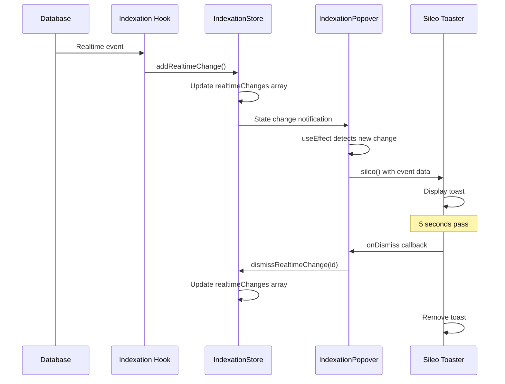
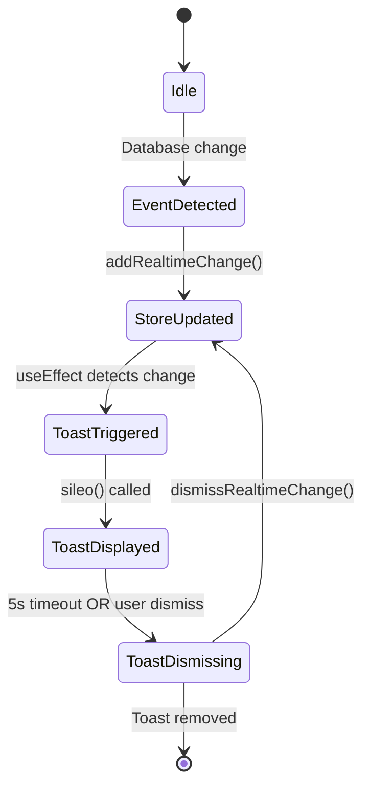
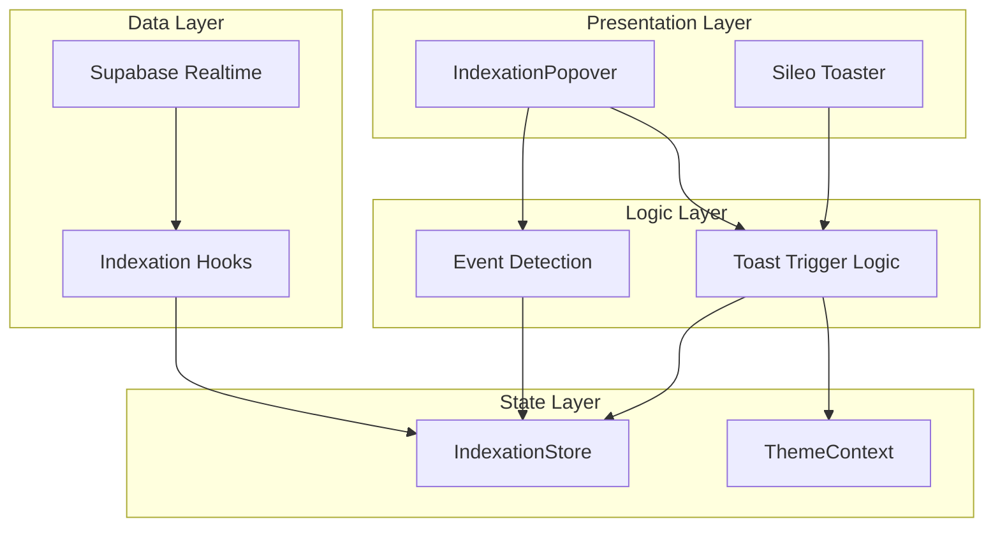

# Design Document: Sileo Toast Notification Integration

## Overview

This design document specifies the technical implementation for integrating the Sileo toast notification library into the IndexationPopover component. The integration will replace custom real-time change notification cards with professional, physics-based toast notifications while preserving all existing indexation progress functionality.

### Goals

- Replace custom AnimatePresence notification cards with Sileo toasts
- Reduce code complexity by removing custom animation logic
- Provide a more standard and professional toast notification UX
- Maintain all existing functionality (indexation progress, reconnection status, error handling)
- Ensure dark mode compatibility
- Preserve performance characteristics

### Non-Goals

- Modifying the IndexationStore state structure
- Changing the indexation progress popover UI
- Altering the realtime event detection logic
- Implementing custom toast animations (use Sileo's built-in physics)

## Architecture

### High-Level Architecture

```
┌─────────────────────────────────────────────────────────────┐
│                      Next.js App Layout                      │
│  ┌────────────────────────────────────────────────────────┐ │
│  │              Sileo Toaster Component                   │ │
│  │  (Global toast container - top-right position)         │ │
│  └────────────────────────────────────────────────────────┘ │
│                                                               │
│  ┌────────────────────────────────────────────────────────┐ │
│  │           IndexationPopover Component                  │ │
│  │  ┌──────────────────────────────────────────────────┐ │ │
│  │  │  Indexation Progress Display                     │ │ │
│  │  │  - Module progress bars                          │ │ │
│  │  │  - Reconnection status                           │ │ │
│  │  │  - Error indicators                              │ │ │
│  │  └──────────────────────────────────────────────────┘ │ │
│  │                                                          │ │
│  │  ┌──────────────────────────────────────────────────┐ │ │
│  │  │  Toast Trigger Logic                             │ │ │
│  │  │  - Watch realtimeChanges array                   │ │ │
│  │  │  - Watch module completion                       │ │ │
│  │  │  - Watch reconnection status                     │ │ │
│  │  │  - Call sileo() to create toasts                 │ │ │
│  │  └──────────────────────────────────────────────────┘ │ │
│  └────────────────────────────────────────────────────────┘ │
│                                                               │
│  ┌────────────────────────────────────────────────────────┐ │
│  │              IndexationStore (Zustand)                 │ │
│  │  - realtimeChanges: RealtimeChangeEvent[]             │ │
│  │  - modules: Record<string, ModuleIndexationState>     │ │
│  │  - addRealtimeChange()                                │ │
│  │  - dismissRealtimeChange()                            │ │
│  └────────────────────────────────────────────────────────┘ │
└─────────────────────────────────────────────────────────────┘
```

### Component Hierarchy

```
app/layout.tsx (or root component)
├── ThemeProvider
│   └── Toaster (Sileo)
│       └── [Toast notifications rendered here]
│
└── IndexationPopover
    ├── useIndexationStore (realtime changes)
    ├── useTheme (dark mode)
    ├── useEffect (watch for events → trigger sileo())
    └── Progress Display (existing UI)
```

### Data Flow

```
1. Database Change Event
   ↓
2. Realtime Subscription (in indexation hooks)
   ↓
3. IndexationStore.addRealtimeChange()
   ↓
4. realtimeChanges array updated
   ↓
5. IndexationPopover useEffect detects new change
   ↓
6. sileo() called with event data
   ↓
7. Toaster displays toast notification
   ↓
8. Auto-dismiss after 5s OR user dismisses
   ↓
9. IndexationStore.dismissRealtimeChange()
```

## Components and Interfaces

### 1. Toaster Component Integration

**Location**: `src/app/layout.tsx` or main app component

**Implementation**:

```typescript
import { Toaster } from 'sileo';
import { useTheme } from '@/context/ThemeContext';

export default function RootLayout({ children }: { children: React.ReactNode }) {
  const { isDarkMode } = useTheme();
  
  return (
    <html>
      <body>
        <ThemeProvider>
          {children}
          <Toaster
            theme={isDarkMode ? 'dark' : 'light'}
            position="top-right"
            offset="80px" // Below header
            gap={8}
            visibleToasts={3}
          />
        </ThemeProvider>
      </body>
    </html>
  );
}
```

**Configuration Options**:
- `theme`: 'light' | 'dark' - Controlled by useTheme hook
- `position`: 'top-right' - Avoids conflict with IndexationPopover
- `offset`: '80px' - Positions below header component
- `gap`: 8 - Spacing between stacked toasts
- `visibleToasts`: 3 - Matches existing limit

### 2. IndexationPopover Modifications

**Current Structure** (to be preserved):
- Module progress bars with animated progress
- Success indicators with check marks
- Error states with retry buttons
- Reconnection status indicators
- Auto-hide countdown

**To Be Removed**:
- AnimatePresence block for realtimeChanges rendering (lines ~240-290)
- Custom motion.div notification cards
- Custom notification card styling and animations

**To Be Added**:
- useEffect hook to watch realtimeChanges and trigger toasts
- useEffect hook to watch module completion and trigger success toasts
- useEffect hook to watch reconnection status and trigger info/error toasts
- Toast trigger functions using sileo()

### 3. Toast Trigger Logic

**Implementation Pattern**:

```typescript
import { sileo } from 'sileo';
import { Plus, Edit2, Trash2 } from 'lucide-react';

// In IndexationPopover component:

// Watch for new realtime changes
useEffect(() => {
  const latestChange = realtimeChanges[0]; // Most recent
  if (!latestChange || latestChange.dismissed) return;
  
  const EventIcon = getEventIcon(latestChange.eventType);
  const eventColor = getEventColor(latestChange.eventType);
  const eventText = getEventText(latestChange.eventType);
  
  sileo(
    <div className="flex items-center gap-2">
      <EventIcon className="w-4 h-4" style={{ color: eventColor }} />
      <div>
        <div className="font-semibold text-sm">{eventText}</div>
        <div className="text-xs opacity-70">
          {latestChange.table === 'config' ? 'CONFIGURACIÓN' : latestChange.moduleName}
        </div>
      </div>
    </div>,
    {
      duration: 5000,
      onDismiss: () => dismissRealtimeChange(latestChange.id),
      style: {
        background: isDarkMode ? '#000' : '#fff',
        color: isDarkMode ? '#fff' : '#000',
        border: `1px solid ${eventColor}33`,
      }
    }
  );
}, [realtimeChanges]);

// Watch for module completion
useEffect(() => {
  modules.forEach(module => {
    const prev = prevStatesRef.current[module.key] || { isIndexing: false, isIndexed: false };
    if (prev.isIndexing && !module.state.isIndexing && module.state.isIndexed && !module.state.error) {
      const Icon = module.config.icon;
      sileo(
        <div className="flex items-center gap-2">
          <Icon className="w-4 h-4" style={{ color: module.config.glowColor }} />
          <div>
            <div className="font-semibold text-sm">Indexación completada</div>
            <div className="text-xs opacity-70">{module.name}</div>
          </div>
        </div>,
        {
          duration: 5000,
          style: {
            background: isDarkMode ? '#000' : '#fff',
            color: isDarkMode ? '#fff' : '#000',
            border: `1px solid ${module.config.glowColor}`,
          }
        }
      );
    }
    prevStatesRef.current[module.key] = { isIndexing: module.state.isIndexing, isIndexed: module.state.isIndexed };
  });
}, [modules]);

// Watch for reconnection failures
useEffect(() => {
  modules.forEach(module => {
    if (module.state.reconnectionStatus === 'failed') {
      sileo(
        <div className="flex items-center gap-2">
          <WifiOff className="w-4 h-4 text-orange-400" />
          <div>
            <div className="font-semibold text-sm text-orange-400">Conexión perdida</div>
            <div className="text-xs opacity-70">{module.name}</div>
          </div>
        </div>,
        {
          duration: Infinity, // Stays until dismissed or reconnected
          style: {
            background: isDarkMode ? '#000' : '#fff',
            color: isDarkMode ? '#fff' : '#000',
            border: '1px solid #fb923c',
          }
        }
      );
    }
  });
}, [modules.map(m => m.state.reconnectionStatus).join(',')]);
```

### 4. Utility Functions (Preserved)

These existing functions will be reused for toast content:

```typescript
// Already exists in IndexationPopover.tsx
const getEventIcon = (eventType: string) => {
  switch (eventType) {
    case 'INSERT': return Plus;
    case 'UPDATE': return Edit2;
    case 'DELETE': return Trash2;
    default: return Bell;
  }
};

const getEventColor = (eventType: string) => {
  switch (eventType) {
    case 'INSERT': return '#10b981'; // green
    case 'UPDATE': return '#3b82f6'; // blue
    case 'DELETE': return '#ef4444'; // red
    default: return '#6b7280'; // gray
  }
};

const getEventText = (eventType: string) => {
  switch (eventType) {
    case 'INSERT': return 'Agregado';
    case 'UPDATE': return 'Actualizado';
    case 'DELETE': return 'Eliminado';
    default: return 'Cambio';
  }
};
```

## Data Models

### RealtimeChangeEvent (Existing - No Changes)

```typescript
export interface RealtimeChangeEvent {
  id: string;
  moduleKey: string;
  moduleName: string;
  table: string;
  eventType: 'INSERT' | 'UPDATE' | 'DELETE';
  timestamp: string;
  recordId?: number | string;
  recordName?: string;
  dismissed?: boolean;
}
```

### ModuleIndexationState (Existing - No Changes)

```typescript
export interface ModuleIndexationState {
  isIndexed: boolean;
  isIndexing: boolean;
  progress: number;
  currentStage: string | null;
  error: string | null;
  realtimeConnected: boolean;
  lastIndexedAt: string | null;
  lastEventReceivedAt: string | null;
  disconnectedAt: string | null;
  reconnectionAttempts: number;
  reconnectionStatus: ReconnectionStatus;
  maxReconnectionAttempts: number;
}
```

### Sileo Toast Options

```typescript
interface ToastOptions {
  duration?: number; // milliseconds, or Infinity
  position?: 'top-left' | 'top-right' | 'bottom-left' | 'bottom-right';
  onDismiss?: () => void;
  style?: React.CSSProperties;
  className?: string;
}
```

## Correctness Properties

*A property is a characteristic or behavior that should hold true across all valid executions of a system-essentially, a formal statement about what the system should do. Properties serve as the bridge between human-readable specifications and machine-verifiable correctness guarantees.*


### Property Reflection

After analyzing all acceptance criteria, I've identified the following properties that can be consolidated:

**Redundancies Identified:**
1. Properties 14.1-14.4 (Toast includes moduleKey, moduleName, table, eventType) can be combined into a single property about toast metadata completeness
2. Properties 9.2 and 9.3 (dark/light mode styling) can be combined into a single property about theme-appropriate styling
3. Properties 6.2 and 6.3 (success toast content and styling) can be combined into a single comprehensive property
4. Properties 7.2 and 7.4 (error toast content and styling) can be combined into a single comprehensive property
5. Properties 8.2 and 8.3 (reconnection toast messages) can be combined into a single property about reconnection status display

**Properties to Keep:**
- Realtime change toast display (3.1)
- Toast filtering logic (3.3)
- Auto-dismiss behavior (3.4)
- Module name display logic (4.4)
- Toast dismissal triggers store update (5.2)
- Dismissed toast removal (5.3)
- Module completion triggers success toast (6.1)
- Connection failure triggers error toast (7.1)
- Reconnection status triggers info toast (8.1)
- Reconnection completion dismisses toast (8.4)
- Theme value propagation (9.1)
- Store integration preserved (11.2, 11.3)
- Toast metadata completeness (consolidated 14.1-14.4)
- Visible toast limit (15.1)

### Property 1: Realtime Change Toast Display

*For any* realtime change event added to the IndexationStore, the system should display a Sileo toast notification with the appropriate event type, icon, and color.

**Validates: Requirements 3.1**

### Property 2: Toast Filtering Consistency

*For any* state of the realtimeChanges array, the displayed toasts should only include non-dismissed changes and be limited to a maximum of 3 toasts.

**Validates: Requirements 3.3, 15.1**

### Property 3: Auto-Dismiss Timing

*For any* realtime change toast, the toast should automatically dismiss after 5 seconds and trigger the dismissRealtimeChange function in IndexationStore.

**Validates: Requirements 3.4, 5.2**

### Property 4: Module Name Display Logic

*For any* realtime change event, if the table is 'config' then the toast should display "CONFIGURACIÓN", otherwise it should display the moduleName from the event.

**Validates: Requirements 4.4**

### Property 5: Toast Dismissal Store Update

*For any* toast dismissal action (manual or automatic), the system should call dismissRealtimeChange with the corresponding event ID.

**Validates: Requirements 5.2, 11.3**

### Property 6: Dismissed Toast Removal

*For any* dismissed toast, the toast should be removed from the display and the realtimeChanges array should be updated accordingly.

**Validates: Requirements 5.3**

### Property 7: Module Completion Success Toast

*For any* module that transitions from isIndexing=true to isIndexed=true without errors, the system should display a success toast containing the module name, completion message, and module's glowColor.

**Validates: Requirements 6.1, 6.2, 6.3**

### Property 8: Connection Failure Error Toast

*For any* module whose reconnectionStatus changes to 'failed', the system should display an error toast containing the module name, "Conexión perdida" message, and red/orange color scheme.

**Validates: Requirements 7.1, 7.2, 7.4**

### Property 9: Reconnection Status Info Toast

*For any* module whose reconnectionStatus changes to 'reconnecting' or 'reconciling', the system should display an info toast with the appropriate status message ("Reconectando..." or "Sincronizando...") and attempt count when applicable.

**Validates: Requirements 8.1, 8.2, 8.3**

### Property 10: Reconnection Success Toast Dismissal

*For any* module that successfully completes reconnection (reconnectionStatus changes from 'reconnecting'/'reconciling' to 'idle'), any active reconnection toast for that module should be dismissed.

**Validates: Requirements 8.4**

### Property 11: Theme Propagation

*For any* change in the isDarkMode value from useTheme, the Toaster component should receive the corresponding theme prop ('dark' or 'light').

**Validates: Requirements 9.1, 2.2**

### Property 12: Theme-Appropriate Styling

*For any* toast displayed, the background and text colors should match the current theme (dark backgrounds with light text when isDarkMode=true, light backgrounds with dark text when isDarkMode=false).

**Validates: Requirements 9.2, 9.3**

### Property 13: Store Method Invocation

*For any* new realtime event detected by indexation hooks, the addRealtimeChange method should be called on IndexationStore.

**Validates: Requirements 11.2**

### Property 14: Toast Metadata Completeness

*For any* toast created from a RealtimeChangeEvent, the toast should include all available metadata fields (moduleKey, moduleName, table, eventType, and optionally recordId and recordName when present).

**Validates: Requirements 14.1, 14.2, 14.3, 14.4, 14.5**


## Error Handling

### Toast Display Errors

**Error**: Sileo library fails to render toast
- **Detection**: Monitor console for Sileo errors
- **Recovery**: Fall back to console.warn with event details
- **Prevention**: Validate toast content before calling sileo()

**Error**: Invalid event data structure
- **Detection**: Type checking on RealtimeChangeEvent
- **Recovery**: Log error and skip toast display
- **Prevention**: Maintain strict TypeScript types

### Theme Context Errors

**Error**: useTheme hook returns undefined
- **Detection**: Check for undefined isDarkMode value
- **Recovery**: Default to light theme
- **Prevention**: Ensure ThemeProvider wraps Toaster

### Store Integration Errors

**Error**: dismissRealtimeChange not found
- **Detection**: TypeScript compilation error
- **Recovery**: N/A - compilation will fail
- **Prevention**: Maintain IndexationStore interface

**Error**: realtimeChanges array is undefined
- **Detection**: Runtime check for undefined
- **Recovery**: Default to empty array
- **Prevention**: Initialize store properly

### Performance Errors

**Error**: Too many toasts causing performance degradation
- **Detection**: Monitor toast count
- **Recovery**: Enforce 3-toast limit via Toaster config
- **Prevention**: Set visibleToasts={3} on Toaster

**Error**: Memory leak from undismissed toasts
- **Detection**: Monitor memory usage over time
- **Recovery**: Force cleanup of old toasts
- **Prevention**: Ensure auto-dismiss is configured

## Testing Strategy

### Dual Testing Approach

This feature requires both unit tests and property-based tests to ensure comprehensive coverage:

- **Unit tests**: Verify specific examples, edge cases, and integration points
- **Property tests**: Verify universal properties across all inputs

### Unit Testing

Unit tests should focus on:

1. **Installation Verification**
   - Test: Verify sileo package exists in package.json
   - Test: Verify Toaster component is imported in layout

2. **Component Integration**
   - Test: Toaster renders with correct theme prop
   - Test: Toaster renders client-side only (not SSR)
   - Test: IndexationPopover no longer renders AnimatePresence notification cards

3. **Event Type Rendering**
   - Test: INSERT event displays "Agregado" with Plus icon and green color
   - Test: UPDATE event displays "Actualizado" with Edit2 icon and blue color
   - Test: DELETE event displays "Eliminado" with Trash2 icon and red color

4. **Specific Scenarios**
   - Test: Config table changes display "CONFIGURACIÓN"
   - Test: Success toast auto-dismisses after 5 seconds
   - Test: Error toast has infinite duration
   - Test: Toast includes close button

5. **Preserved Functionality**
   - Test: IndexationPopover displays progress bars
   - Test: IndexationPopover shows module states
   - Test: IndexationPopover auto-hides after completion
   - Test: IndexationStore interface unchanged

6. **Code Cleanup**
   - Test: AnimatePresence block removed
   - Test: Custom motion.div cards removed
   - Test: Line count reduced in IndexationPopover.tsx

7. **Memory Management**
   - Test: Dismissed toasts cleaned up within 1 second

### Property-Based Testing

Property tests should be configured with:
- **Minimum 100 iterations** per test
- **Tag format**: `Feature: indexation-popover-sileo-integration, Property {number}: {property_text}`

Property tests should focus on:

1. **Property 1: Realtime Change Toast Display**
   - Generate: Random RealtimeChangeEvent objects
   - Action: Add to IndexationStore
   - Assert: Toast is displayed with correct event type, icon, and color

2. **Property 2: Toast Filtering Consistency**
   - Generate: Random realtimeChanges arrays with varying dismissed states
   - Assert: Displayed toasts are non-dismissed and limited to 3

3. **Property 3: Auto-Dismiss Timing**
   - Generate: Random RealtimeChangeEvent objects
   - Action: Display toast and wait 5 seconds
   - Assert: dismissRealtimeChange called with correct ID

4. **Property 4: Module Name Display Logic**
   - Generate: Random RealtimeChangeEvent objects with varying table values
   - Assert: Toast displays "CONFIGURACIÓN" for config table, moduleName otherwise

5. **Property 5: Toast Dismissal Store Update**
   - Generate: Random toast dismissal actions
   - Assert: dismissRealtimeChange called for each dismissal

6. **Property 6: Dismissed Toast Removal**
   - Generate: Random dismissed toast IDs
   - Assert: Toast removed from display and realtimeChanges array updated

7. **Property 7: Module Completion Success Toast**
   - Generate: Random module state transitions (isIndexing→isIndexed)
   - Assert: Success toast displayed with module name, message, and glowColor

8. **Property 8: Connection Failure Error Toast**
   - Generate: Random module reconnectionStatus changes to 'failed'
   - Assert: Error toast displayed with module name and error message

9. **Property 9: Reconnection Status Info Toast**
   - Generate: Random module reconnectionStatus changes to 'reconnecting'/'reconciling'
   - Assert: Info toast displayed with appropriate status message

10. **Property 10: Reconnection Success Toast Dismissal**
    - Generate: Random module reconnection completions
    - Assert: Active reconnection toast dismissed

11. **Property 11: Theme Propagation**
    - Generate: Random isDarkMode values (true/false)
    - Assert: Toaster receives corresponding theme prop

12. **Property 12: Theme-Appropriate Styling**
    - Generate: Random isDarkMode values and toast events
    - Assert: Toast colors match theme (dark bg/light text or light bg/dark text)

13. **Property 13: Store Method Invocation**
    - Generate: Random realtime events from indexation hooks
    - Assert: addRealtimeChange called for each event

14. **Property 14: Toast Metadata Completeness**
    - Generate: Random RealtimeChangeEvent objects with varying metadata
    - Assert: Toast includes all available metadata fields

### Testing Library Selection

**Property-Based Testing Library**: 
- **JavaScript/TypeScript**: Use `fast-check` library
- Installation: `npm install --save-dev fast-check @types/fast-check`
- Reason: Native TypeScript support, excellent React integration

**Unit Testing Library**:
- **React Testing Library**: For component testing
- **Jest**: For test runner and assertions
- **@testing-library/user-event**: For user interaction simulation

### Test Configuration

```typescript
// Example property test configuration
import fc from 'fast-check';

describe('Property Tests - Sileo Integration', () => {
  it('Property 1: Realtime Change Toast Display', () => {
    fc.assert(
      fc.property(
        fc.record({
          moduleKey: fc.string(),
          moduleName: fc.string(),
          table: fc.string(),
          eventType: fc.constantFrom('INSERT', 'UPDATE', 'DELETE'),
          timestamp: fc.date().map(d => d.toISOString()),
        }),
        (event) => {
          // Feature: indexation-popover-sileo-integration, Property 1: Realtime Change Toast Display
          // Test implementation here
        }
      ),
      { numRuns: 100 }
    );
  });
});
```


## Implementation Details

### Step 1: Install Sileo Library

```bash
npm install sileo
```

Verify installation in `package.json`:
```json
{
  "dependencies": {
    "sileo": "^latest"
  }
}
```

### Step 2: Add Toaster to Layout

**File**: `src/app/layout.tsx` (or appropriate root component)

```typescript
'use client';

import { Toaster } from 'sileo';
import { useTheme } from '@/context/ThemeContext';

export default function RootLayout({ children }: { children: React.ReactNode }) {
  const { isDarkMode } = useTheme();
  
  return (
    <html lang="es">
      <body>
        <ThemeProvider>
          {children}
          <Toaster
            theme={isDarkMode ? 'dark' : 'light'}
            position="top-right"
            offset="80px"
            gap={8}
            visibleToasts={3}
          />
        </ThemeProvider>
      </body>
    </html>
  );
}
```

**Key Configuration**:
- `theme`: Dynamically set based on useTheme hook
- `position`: "top-right" to avoid IndexationPopover conflict
- `offset`: "80px" to position below header
- `gap`: 8px spacing between toasts
- `visibleToasts`: 3 to match existing limit

### Step 3: Modify IndexationPopover Component

**File**: `src/components/IndexationPopover.tsx`

#### 3.1: Add Sileo Import

```typescript
import { sileo } from 'sileo';
```

#### 3.2: Remove Custom Notification Card Rendering

**Remove this entire block** (approximately lines 240-290):

```typescript
// DELETE THIS SECTION:
<AnimatePresence>
  {realtimeChanges
    .filter(change => !change.dismissed)
    .slice(0, 3)
    .map((change) => {
      // ... custom notification card JSX
    })}
</AnimatePresence>
```

#### 3.3: Add Toast Trigger Logic

Add these useEffect hooks after the existing hooks:

```typescript
// Track previous realtime changes to detect new ones
const prevRealtimeChangesRef = useRef<RealtimeChangeEvent[]>([]);

// Watch for new realtime changes and trigger toasts
useEffect(() => {
  const newChanges = realtimeChanges.filter(
    change => !prevRealtimeChangesRef.current.some(prev => prev.id === change.id)
  );
  
  newChanges.forEach(change => {
    if (change.dismissed) return;
    
    const EventIcon = getEventIcon(change.eventType);
    const eventColor = getEventColor(change.eventType);
    const eventText = getEventText(change.eventType);
    
    sileo(
      <div className="flex items-center gap-3">
        <div 
          className="p-2 rounded-xl flex-shrink-0"
          style={{ backgroundColor: `${eventColor}33` }}
        >
          <EventIcon className="w-4 h-4" style={{ color: eventColor }} />
        </div>
        <div className="flex-1 min-w-0">
          <div className="font-semibold text-sm" style={{ color: eventColor }}>
            {eventText}
          </div>
          <div className={`text-xs ${isDarkMode ? 'text-gray-400' : 'text-gray-600'}`}>
            {change.table === 'config' ? 'CONFIGURACIÓN' : change.moduleName}
          </div>
        </div>
      </div>,
      {
        duration: 5000,
        onDismiss: () => dismissRealtimeChange(change.id),
        style: {
          background: isDarkMode ? '#000' : '#fff',
          color: isDarkMode ? '#fff' : '#000',
          border: `1px solid ${eventColor}33`,
        }
      }
    );
  });
  
  prevRealtimeChangesRef.current = realtimeChanges;
}, [realtimeChanges, isDarkMode, dismissRealtimeChange]);

// Watch for module completion and trigger success toasts
useEffect(() => {
  modules.forEach(module => {
    const prev = prevStatesRef.current[module.key] || { isIndexing: false, isIndexed: false };
    
    if (prev.isIndexing && !module.state.isIndexing && module.state.isIndexed && !module.state.error) {
      const Icon = module.config.icon;
      
      sileo(
        <div className="flex items-center gap-3">
          <div 
            className="p-2 rounded-xl flex-shrink-0"
            style={{ 
              background: `linear-gradient(135deg, ${module.config.glowColor}33, ${module.config.glowColor}1a)` 
            }}
          >
            <Icon className="w-4 h-4" style={{ color: module.config.glowColor }} />
          </div>
          <div className="flex-1">
            <div className="font-semibold text-sm">Indexación completada</div>
            <div className={`text-xs ${isDarkMode ? 'text-gray-400' : 'text-gray-600'}`}>
              {module.name}
            </div>
          </div>
        </div>,
        {
          duration: 5000,
          style: {
            background: isDarkMode ? '#000' : '#fff',
            color: isDarkMode ? '#fff' : '#000',
            border: `1px solid ${module.config.glowColor}`,
          }
        }
      );
    }
    
    prevStatesRef.current[module.key] = { 
      isIndexing: module.state.isIndexing, 
      isIndexed: module.state.isIndexed 
    };
  });
}, [modules, isDarkMode]);

// Track previous reconnection statuses
const prevReconnectionStatusRef = useRef<Record<string, string>>({});

// Watch for reconnection status changes and trigger toasts
useEffect(() => {
  modules.forEach(module => {
    const prevStatus = prevReconnectionStatusRef.current[module.key] || 'idle';
    const currentStatus = module.state.reconnectionStatus;
    
    // Connection failed
    if (currentStatus === 'failed' && prevStatus !== 'failed') {
      const Icon = module.config.icon;
      
      sileo(
        <div className="flex items-center gap-3">
          <div className="p-2 rounded-xl bg-orange-500/20 flex-shrink-0">
            <Icon className="w-4 h-4 text-orange-400" />
          </div>
          <div className="flex-1">
            <div className="font-semibold text-sm text-orange-400">Conexión perdida</div>
            <div className={`text-xs ${isDarkMode ? 'text-gray-400' : 'text-gray-600'}`}>
              {module.name} - Se recomienda reindexar
            </div>
          </div>
        </div>,
        {
          duration: Infinity,
          style: {
            background: isDarkMode ? '#000' : '#fff',
            color: isDarkMode ? '#fff' : '#000',
            border: '1px solid #fb923c',
          }
        }
      );
    }
    
    // Reconnecting
    if (currentStatus === 'reconnecting' && prevStatus !== 'reconnecting') {
      const Icon = module.config.icon;
      
      sileo(
        <div className="flex items-center gap-3">
          <div 
            className="p-2 rounded-xl flex-shrink-0"
            style={{ backgroundColor: `${module.config.glowColor}33` }}
          >
            <Icon className="w-4 h-4" style={{ color: module.config.glowColor }} />
          </div>
          <div className="flex-1">
            <div className="font-semibold text-sm text-yellow-400">Reconectando...</div>
            <div className={`text-xs ${isDarkMode ? 'text-gray-400' : 'text-gray-600'}`}>
              {module.name} - Intento {module.state.reconnectionAttempts + 1}/{module.state.maxReconnectionAttempts}
            </div>
          </div>
        </div>,
        {
          duration: 10000,
          style: {
            background: isDarkMode ? '#000' : '#fff',
            color: isDarkMode ? '#fff' : '#000',
            border: '1px solid #eab308',
          }
        }
      );
    }
    
    // Reconciling
    if (currentStatus === 'reconciling' && prevStatus !== 'reconciling') {
      const Icon = module.config.icon;
      
      sileo(
        <div className="flex items-center gap-3">
          <div 
            className="p-2 rounded-xl flex-shrink-0"
            style={{ backgroundColor: `${module.config.glowColor}33` }}
          >
            <Icon className="w-4 h-4" style={{ color: module.config.glowColor }} />
          </div>
          <div className="flex-1">
            <div className="font-semibold text-sm text-blue-400">Sincronizando...</div>
            <div className={`text-xs ${isDarkMode ? 'text-gray-400' : 'text-gray-600'}`}>
              {module.name} - Recuperando datos perdidos
            </div>
          </div>
        </div>,
        {
          duration: 10000,
          style: {
            background: isDarkMode ? '#000' : '#fff',
            color: isDarkMode ? '#fff' : '#000',
            border: '1px solid #3b82f6',
          }
        }
      );
    }
    
    prevReconnectionStatusRef.current[module.key] = currentStatus;
  });
}, [modules.map(m => m.state.reconnectionStatus).join(','), isDarkMode]);
```

#### 3.4: Update JSX Return

The JSX should now only contain the IndexationPopover (progress display), not the notification cards:

```typescript
return (
  <div className="fixed top-20 right-4 z-40 flex flex-col gap-2 max-w-sm">
    {/* Notification cards section REMOVED - now handled by Sileo toasts */}
    
    {/* Popover de indexación (only if there are active modules) */}
    {activeModules.length > 0 && (
      <>
        {/* Success particles - preserved */}
        {/* ... existing success animation code ... */}
        
        {/* Main popover - preserved */}
        <motion.div className={/* ... existing styles ... */}>
          {/* ... existing progress display code ... */}
        </motion.div>
      </>
    )}
  </div>
);
```

### Step 4: Verify Utility Functions

Ensure these utility functions remain in IndexationPopover.tsx (they're reused for toast content):

```typescript
const getEventIcon = (eventType: string) => {
  switch (eventType) {
    case 'INSERT': return Plus;
    case 'UPDATE': return Edit2;
    case 'DELETE': return Trash2;
    default: return Bell;
  }
};

const getEventColor = (eventType: string) => {
  switch (eventType) {
    case 'INSERT': return '#10b981';
    case 'UPDATE': return '#3b82f6';
    case 'DELETE': return '#ef4444';
    default: return '#6b7280';
  }
};

const getEventText = (eventType: string) => {
  switch (eventType) {
    case 'INSERT': return 'Agregado';
    case 'UPDATE': return 'Actualizado';
    case 'DELETE': return 'Eliminado';
    default: return 'Cambio';
  }
};
```


## Migration Strategy

### Phase 1: Preparation (Low Risk)

**Objective**: Install dependencies and verify compatibility

**Steps**:
1. Install Sileo package: `npm install sileo`
2. Verify package.json includes sileo dependency
3. Run `npm run build` to ensure no conflicts
4. Review Sileo documentation for API changes

**Rollback**: Remove package if incompatible

**Success Criteria**:
- Build completes without errors
- No TypeScript compilation errors
- No dependency conflicts

### Phase 2: Toaster Integration (Low Risk)

**Objective**: Add Toaster component to layout without affecting existing functionality

**Steps**:
1. Add Toaster import to layout.tsx
2. Add Toaster component with configuration
3. Ensure Toaster is wrapped by ThemeProvider
4. Test that Toaster renders client-side only
5. Verify no visual conflicts with existing UI

**Rollback**: Remove Toaster component from layout

**Success Criteria**:
- Toaster renders without errors
- Theme prop updates correctly
- No layout shifts or visual conflicts
- Existing functionality unaffected

### Phase 3: Toast Trigger Implementation (Medium Risk)

**Objective**: Add toast trigger logic without removing existing notification cards

**Steps**:
1. Add sileo import to IndexationPopover
2. Add useEffect hooks for toast triggers
3. Add ref tracking for previous states
4. Test toast display for each event type
5. Verify toast dismissal triggers store updates
6. Confirm both toasts AND notification cards display (temporarily)

**Rollback**: Remove useEffect hooks and sileo calls

**Success Criteria**:
- Toasts display for realtime changes
- Toasts display for module completion
- Toasts display for reconnection status
- Store methods called correctly
- Existing notification cards still work

### Phase 4: Notification Card Removal (High Risk)

**Objective**: Remove custom notification card code

**Steps**:
1. Comment out AnimatePresence notification card block
2. Test that toasts still display correctly
3. Verify no console errors
4. Test all event types (INSERT, UPDATE, DELETE)
5. Test module completion scenarios
6. Test reconnection scenarios
7. If successful, delete commented code
8. Remove unused imports (if any)

**Rollback**: Uncomment AnimatePresence block, remove toast triggers

**Success Criteria**:
- Toasts display for all event types
- No notification cards visible
- No console errors
- All functionality preserved
- Code is cleaner and more maintainable

### Phase 5: Testing and Validation (Low Risk)

**Objective**: Comprehensive testing of the integration

**Steps**:
1. Run unit tests
2. Run property-based tests
3. Manual testing in development
4. Test dark mode switching
5. Test with multiple simultaneous events
6. Test reconnection scenarios
7. Performance testing (memory, FPS)
8. Accessibility testing

**Rollback**: N/A (testing phase)

**Success Criteria**:
- All tests pass
- No performance degradation
- No memory leaks
- Accessibility maintained
- User experience improved

### Phase 6: Deployment (Low Risk)

**Objective**: Deploy to production

**Steps**:
1. Merge feature branch
2. Deploy to staging environment
3. Smoke test in staging
4. Deploy to production
5. Monitor for errors
6. Gather user feedback

**Rollback**: Revert commit and redeploy previous version

**Success Criteria**:
- No production errors
- No user complaints
- Performance metrics stable
- Toast notifications working correctly

### Testing During Migration

**After Each Phase**:
1. Run `npm run build` to verify no build errors
2. Run `npm run test` to verify no test failures
3. Start dev server and manually test affected features
4. Check browser console for errors
5. Test in both light and dark modes

**Critical Test Scenarios**:
1. Add new item to database → Toast displays
2. Update existing item → Toast displays
3. Delete item → Toast displays
4. Module completes indexation → Success toast displays
5. Connection lost → Error toast displays
6. Reconnection attempt → Info toast displays
7. Dismiss toast manually → Toast removed, store updated
8. Wait 5 seconds → Toast auto-dismisses
9. Multiple events simultaneously → Max 3 toasts displayed
10. Switch dark mode → Toast colors update

### Rollback Strategy

**If Issues Arise**:

1. **Build Errors**: Remove Sileo package, revert code changes
2. **Runtime Errors**: Comment out toast trigger logic, keep notification cards
3. **Performance Issues**: Reduce visibleToasts limit, adjust duration
4. **Visual Conflicts**: Adjust Toaster position/offset
5. **Theme Issues**: Add fallback theme value

**Complete Rollback**:
```bash
# Revert all changes
git revert <commit-hash>

# Remove Sileo package
npm uninstall sileo

# Rebuild
npm run build

# Redeploy
npm run deploy
```

### Success Metrics

**Code Quality**:
- Lines of code reduced by ~50-100 lines in IndexationPopover.tsx
- Fewer custom animation configurations
- Simpler component structure

**Functionality**:
- All 15 requirements met
- All 14 properties verified
- No regressions in existing features

**Performance**:
- No increase in bundle size (Sileo is lightweight)
- 60fps animation performance maintained
- No memory leaks
- Toast display latency < 100ms

**User Experience**:
- Professional toast animations
- Consistent notification UX
- Dark mode support maintained
- Accessibility preserved

## Diagrams

### Component Interaction Flow



### State Management Flow



### Architecture Layers



## Conclusion

This design provides a comprehensive plan for integrating Sileo toast notifications into the IndexationPopover component. The integration will:

1. **Simplify code**: Remove ~50-100 lines of custom animation code
2. **Improve UX**: Professional physics-based toast animations
3. **Maintain functionality**: All existing features preserved
4. **Ensure quality**: Comprehensive testing strategy with property-based tests
5. **Enable safe migration**: Phased rollout with clear rollback strategy

The implementation follows best practices for React component design, state management, and testing. The property-based testing approach ensures correctness across all possible inputs, while unit tests verify specific scenarios and edge cases.

