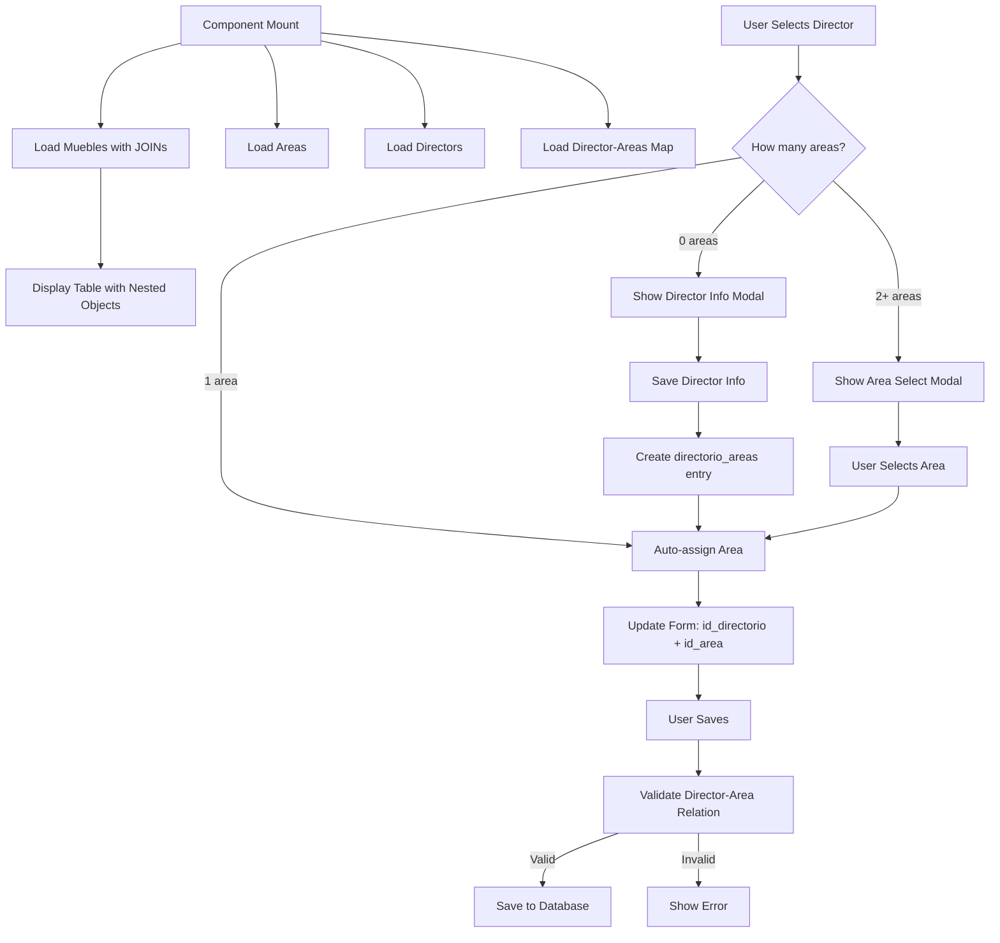

# Design Document: No Listado Relational Migration

## Overview

This design document outlines the technical approach for migrating the "No Listado" component from using plain text fields to relational database fields with foreign keys. The migration involves updating data fetching queries, implementing director-area validation logic, refactoring the edit form, and ensuring type safety throughout the component.

The key challenge is handling the N:M relationship between directors and areas through the `directorio_areas` junction table, which requires conditional logic based on how many areas a director has assigned.

### Goals

1. Replace all text-based area and director fields with relational IDs
2. Implement robust director-area validation using the N:M relationship
3. Provide intuitive UX for director selection with automatic area assignment
4. Maintain type safety with updated TypeScript interfaces
5. Ensure backward compatibility with NULL values during transition

### Non-Goals

1. Migrating other components (INEA, ITEA, Levantamiento) - those are separate specs
2. Modifying the database schema (already completed)
3. Creating new database tables or relationships
4. Implementing bulk data migration scripts

## Architecture

### Component Structure

The No Listado component follows a standard React pattern with hooks for data management:

```
ConsultasNoListadoGeneral (Main Component)
├── useNoListadoIndexation (Data Hook)
├── useSession (Auth Hook)
├── useNotifications (Notifications Hook)
├── useTheme (Theme Hook)
└── Sub-components
    ├── ImagePreview
    ├── SuggestionDropdown
    ├── TableSkeleton
    ├── DirectorModal (NEW)
    └── AreaSelectModal (NEW)
```

### Data Flow



### Database Schema Integration

The component interacts with four main tables:

1. **mueblestlaxcala**: Main inventory table
   - `id` (UUID, PK)
   - `id_area` (INTEGER, FK → area.id_area)
   - `id_directorio` (INTEGER, FK → directorio.id_directorio)
   - Other fields...

2. **area**: Areas/departments table
   - `id_area` (SERIAL, PK)
   - `nombre` (VARCHAR, UNIQUE)

3. **directorio**: Directors/managers table
   - `id_directorio` (SERIAL, PK)
   - `nombre` (VARCHAR)
   - `puesto` (VARCHAR)
   - `area` (VARCHAR, LEGACY - may still exist)

4. **directorio_areas**: N:M junction table
   - `id` (UUID, PK)
   - `id_directorio` (INTEGER, FK)
   - `id_area` (INTEGER, FK)

## Components and Interfaces

### TypeScript Interfaces

#### Updated Mueble Interface

```typescript
interface Mueble {
    id: string; // UUID
    id_inv: string;
    rubro: string | null;
    descripcion: string | null;
    valor: string | null;
    f_adq: string | null;
    formadq: string | null;
    proveedor: string | null;
    factura: string | null;
    ubicacion_es: string | null;
    ubicacion_mu: string | null;
    ubicacion_no: string | null;
    estado: string | null;
    estatus: string | null;
    
    // Relational fields (NEW)
    id_area: number | null;
    id_directorio: number | null;
    
    // Nested objects from JOINs (NEW)
    area: { id_area: number; nombre: string } | null;
    directorio: { id_directorio: number; nombre: string; puesto: string } | null;
    
    fechabaja: string | null;
    causadebaja: string | null;
    resguardante?: string | null;
    image_path?: string | null;
}
```

#### Area Interface

```typescript
interface Area {
    id_area: number;
    nombre: string;
}
```

#### Directorio Interface

```typescript
interface Directorio {
    id_directorio: number;
    nombre: string;
    area: string | null; // Legacy field, may be deprecated
    puesto: string | null;
}
```

#### DirectorioArea Interface

```typescript
interface DirectorioArea {
    id: string; // UUID
    id_directorio: number;
    id_area: number;
}
```

### Data Fetching with JOINs

#### Supabase Query Pattern

```typescript
const { data, error } = await supabase
    .from('mueblestlaxcala')
    .select(`
        *,
        area:area(id_area, nombre),
        directorio:directorio(id_directorio, nombre, puesto)
    `)
    .order('id_inv');
```

This query:
- Fetches all mueble fields
- Performs LEFT JOIN with `area` table on `id_area`
- Performs LEFT JOIN with `directorio` table on `id_directorio`
- Returns nested objects for `area` and `directorio`
- Handles NULL foreign keys gracefully (returns null for nested objects)

#### Loading Director-Area Relationships

```typescript
// Load all areas
const { data: areasData } = await supabase
    .from('area')
    .select('*')
    .order('nombre');

// Load all directors
const { data: directorioData } = await supabase
    .from('directorio')
    .select('*')
    .order('nombre');

// Load director-area relationships
const { data: directorioAreasData } = await supabase
    .from('directorio_areas')
    .select('*');

// Build map: { [id_directorio]: [id_area, id_area, ...] }
const directorAreasMap: { [id_directorio: number]: number[] } = {};
directorioAreasData?.forEach((rel) => {
    if (!directorAreasMap[rel.id_directorio]) {
        directorAreasMap[rel.id_directorio] = [];
    }
    directorAreasMap[rel.id_directorio].push(rel.id_area);
});
```

### Director Selection Logic

The director selection logic is the core of this migration. It handles three scenarios:

#### Scenario 1: Director with No Areas

```typescript
function handleSelectDirector(idDirectorio: number) {
    const selected = directorio.find(d => d.id_directorio === idDirectorio);
    if (!selected) return;

    const areaIds = directorAreasMap[selected.id_directorio] || [];
    const areasForDirector = areas.filter(a => areaIds.includes(a.id_area));

    if (areasForDirector.length === 0) {
        // Show modal to add area information
        setIncompleteDirector(selected);
        setDirectorFormData({ area: '' });
        setShowDirectorModal(true);
        return;
    }
    
    // ... handle other scenarios
}
```

#### Scenario 2: Director with One Area

```typescript
if (areasForDirector.length === 1) {
    // Auto-assign the single area
    setEditFormData(prev => ({
        ...prev!,
        id_directorio: selected.id_directorio,
        id_area: areasForDirector[0].id_area,
        directorio: {
            id_directorio: selected.id_directorio,
            nombre: selected.nombre,
            puesto: selected.puesto || ''
        },
        area: {
            id_area: areasForDirector[0].id_area,
            nombre: areasForDirector[0].nombre
        }
    }));
    return;
}
```

#### Scenario 3: Director with Multiple Areas

```typescript
if (areasForDirector.length > 1) {
    // Show modal to select which area
    setAreaOptionsForDirector(areasForDirector);
    setIncompleteDirector(selected);
    setShowAreaSelectModal(true);
    return;
}
```

### Modal Components

#### Director Information Modal

This modal appears when a director has no assigned areas.

**Purpose**: Allow user to add area information for the director

**Fields**:
- Director name (read-only)
- Area input (text or select)

**Actions**:
- Save: Updates `directorio` table and creates `directorio_areas` entry
- Cancel: Keeps director selection but leaves area empty

**Implementation**:
```typescript
const saveDirectorInfo = async () => {
    if (!incompleteDirector || !directorFormData.area) return;

    setSavingDirector(true);
    try {
        // Update directorio table (legacy field)
        const { error: updateError } = await supabase
            .from('directorio')
            .update({ area: directorFormData.area })
            .eq('id_directorio', incompleteDirector.id_directorio);

        if (updateError) throw updateError;

        // Find or create area
        let areaId: number;
        const { data: existingArea } = await supabase
            .from('area')
            .select('id_area')
            .eq('nombre', directorFormData.area.toUpperCase())
            .single();

        if (existingArea) {
            areaId = existingArea.id_area;
        } else {
            const { data: newArea, error: areaError } = await supabase
                .from('area')
                .insert({ nombre: directorFormData.area.toUpperCase() })
                .select('id_area')
                .single();
            
            if (areaError) throw areaError;
            areaId = newArea.id_area;
        }

        // Create directorio_areas relationship
        const { error: relError } = await supabase
            .from('directorio_areas')
            .insert({
                id_directorio: incompleteDirector.id_directorio,
                id_area: areaId
            });

        if (relError) throw relError;

        // Update form with the new area
        setEditFormData(prev => ({
            ...prev!,
            id_directorio: incompleteDirector.id_directorio,
            id_area: areaId,
            directorio: {
                id_directorio: incompleteDirector.id_directorio,
                nombre: incompleteDirector.nombre,
                puesto: incompleteDirector.puesto || ''
            },
            area: {
                id_area: areaId,
                nombre: directorFormData.area.toUpperCase()
            }
        }));

        setShowDirectorModal(false);
        setMessage({ type: 'success', text: 'Director information updated' });
    } catch (err) {
        console.error(err);
        setMessage({ type: 'error', text: 'Error updating director information' });
    } finally {
        setSavingDirector(false);
    }
};
```

#### Area Selection Modal

This modal appears when a director has multiple assigned areas.

**Purpose**: Allow user to choose which specific area to assign to the item

**Fields**:
- List of areas (radio buttons or select)

**Actions**:
- Confirm: Assigns selected area to the item
- Cancel: Keeps director selection but leaves area empty

**Implementation**:
```typescript
const handleAreaSelection = (selectedArea: Area) => {
    if (!incompleteDirector) return;

    setEditFormData(prev => ({
        ...prev!,
        id_directorio: incompleteDirector.id_directorio,
        id_area: selectedArea.id_area,
        directorio: {
            id_directorio: incompleteDirector.id_directorio,
            nombre: incompleteDirector.nombre,
            puesto: incompleteDirector.puesto || ''
        },
        area: {
            id_area: selectedArea.id_area,
            nombre: selectedArea.nombre
        }
    }));

    setShowAreaSelectModal(false);
};
```

### Edit Form Updates

The edit form needs several changes to work with relational fields:

#### Director Select Dropdown

```typescript
<select
    title='Seleccione el Director/Jefe de Área'
    name="id_directorio"
    value={editFormData?.id_directorio || ''}
    onChange={(e) => handleSelectDirector(Number(e.target.value))}
    className="..."
>
    <option value="">Seleccionar Director/Jefe</option>
    {directorio.map((dir) => (
        <option key={dir.id_directorio} value={dir.id_directorio}>
            {dir.nombre}
        </option>
    ))}
</select>
```

#### Area Display (Read-Only)

```typescript
<input
    type="text"
    value={editFormData?.area?.nombre || ''}
    readOnly
    className="... cursor-not-allowed bg-gray-700"
    aria-label="Área (se autocompleta al seleccionar un director/jefe)"
/>
```

#### Form Change Handler Updates

```typescript
const handleEditFormChange = (
    e: React.ChangeEvent<HTMLInputElement | HTMLSelectElement | HTMLTextAreaElement>,
    field: keyof Mueble
) => {
    if (!editFormData) return;

    const newData = { ...editFormData };
    let value = e.target.value;

    // Force uppercase for text inputs
    if (e.target.tagName === 'INPUT' || e.target.tagName === 'TEXTAREA') {
        value = value.toUpperCase();
    }

    switch (field) {
        case 'id_area':
            newData.id_area = value ? parseInt(value) : null;
            break;
        case 'id_directorio':
            newData.id_directorio = value ? parseInt(value) : null;
            break;
        // ... other fields
    }

    setEditFormData(newData);
};
```

### Validation Logic

#### Director-Area Relationship Validation

```typescript
async function validateDirectorAreaRelation(
    id_directorio: number,
    id_area: number
): Promise<boolean> {
    // Check if the area is in the director's assigned areas
    const { data, error } = await supabase
        .from('directorio_areas')
        .select('id')
        .eq('id_directorio', id_directorio)
        .eq('id_area', id_area)
        .single();
    
    return !error && data !== null;
}
```

#### Pre-Save Validation

```typescript
const saveChanges = async () => {
    if (!editFormData) return;

    // Validate director-area relationship if both are set
    if (editFormData.id_directorio && editFormData.id_area) {
        const isValid = await validateDirectorAreaRelation(
            editFormData.id_directorio,
            editFormData.id_area
        );

        if (!isValid) {
            setMessage({
                type: 'error',
                text: 'El área seleccionada no está asignada a este director'
            });
            return;
        }
    }

    // Proceed with save...
    setUploading(true);
    try {
        // Handle image upload if needed
        let imagePath = editFormData.image_path;
        if (imageFile) {
            const newPath = await uploadImage(editFormData.id);
            if (newPath) imagePath = newPath;
        }

        // Save to database
        const { error } = await supabase
            .from('mueblestlaxcala')
            .update({
                ...editFormData,
                image_path: imagePath
            })
            .eq('id', editFormData.id);

        if (error) throw error;

        // Refetch with JOINs to update display
        const { data: updatedMueble } = await supabase
            .from('mueblestlaxcala')
            .select(`
                *,
                area:area(id_area, nombre),
                directorio:directorio(id_directorio, nombre, puesto)
            `)
            .eq('id', editFormData.id)
            .single();

        if (updatedMueble) {
            setSelectedItem(updatedMueble);
        }

        setIsEditing(false);
        setMessage({ type: 'success', text: 'Cambios guardados correctamente' });
    } catch (error) {
        console.error(error);
        setMessage({ type: 'error', text: 'Error al guardar los cambios' });
    } finally {
        setUploading(false);
    }
};
```

### Display Updates

#### Table Display

```typescript
<td className="px-4 py-3 text-sm">
    {truncateText(item.area?.nombre ?? null, 20)}
</td>
<td className="px-4 py-3 text-sm">
    {truncateText(item.directorio?.nombre ?? null, 20)}
</td>
```

#### Detail Panel Display

```typescript
<div className="detail-field">
    <label>Área</label>
    <span>{selectedItem.area?.nombre || 'No Data'}</span>
</div>
<div className="detail-field">
    <label>Director/Jefe de Área</label>
    <span>{selectedItem.directorio?.nombre || 'No Data'}</span>
</div>
<div className="detail-field">
    <label>Puesto</label>
    <span>{selectedItem.directorio?.puesto || 'No Data'}</span>
</div>
```

### Sorting and Filtering Updates

#### Sorting Logic

```typescript
const paginatedMuebles = filteredMueblesOmni
    .slice()
    .sort((a, b) => {
        let aValue: any;
        let bValue: any;
        
        // Handle nested object fields for sorting
        if (sortField === 'area') {
            aValue = a.area?.nombre ?? '';
            bValue = b.area?.nombre ?? '';
        } else if (sortField === 'directorio') {
            aValue = a.directorio?.nombre ?? '';
            bValue = b.directorio?.nombre ?? '';
        } else {
            aValue = a[sortField] ?? '';
            bValue = b[sortField] ?? '';
        }
        
        if (aValue < bValue) return sortDirection === 'asc' ? -1 : 1;
        if (aValue > bValue) return sortDirection === 'asc' ? 1 : -1;
        return 0;
    })
    .slice((currentPage - 1) * rowsPerPage, currentPage * rowsPerPage);
```

#### Filtering Logic (Omnibox)

```typescript
const filteredMueblesOmni = useMemo(() => {
    const term = deferredSearchTerm.toLowerCase().trim();

    if (activeFilters.length === 0 && !term) return muebles;

    return muebles.filter(item => {
        // Check active filters
        const passesActiveFilters = activeFilters.every(filter => {
            const filterTerm = filter.term.toLowerCase();
            if (!filterTerm) return true;

            switch (filter.type) {
                case 'area':
                    return (item.area?.nombre?.toLowerCase() || '').includes(filterTerm);
                case 'usufinal':
                    return (item.directorio?.nombre?.toLowerCase() || '').includes(filterTerm);
                // ... other cases
                default:
                    return true;
            }
        });

        if (!passesActiveFilters) return false;

        // General search
        if (!term) return true;

        return (
            (item.id_inv?.toLowerCase() || '').includes(term) ||
            (item.descripcion?.toLowerCase() || '').includes(term) ||
            (item.area?.nombre?.toLowerCase() || '').includes(term) ||
            (item.directorio?.nombre?.toLowerCase() || '').includes(term) ||
            (item.resguardante?.toLowerCase() || '').includes(term)
        );
    });
}, [muebles, activeFilters, deferredSearchTerm]);
```

## Data Models

### State Management

The component uses React state for managing:

1. **Muebles Data**: Loaded from indexation hook
2. **Areas**: Array of all areas from `area` table
3. **Directors**: Array of all directors from `directorio` table
4. **Director-Areas Map**: Object mapping director IDs to array of area IDs
5. **Selected Item**: Currently selected mueble for detail view
6. **Edit Form Data**: Copy of selected item being edited
7. **Modal States**: Boolean flags for showing/hiding modals
8. **Incomplete Director**: Director selected that needs area information
9. **Area Options**: List of areas to choose from when director has multiple

### Data Transformation

#### From Database to Component

```typescript
// Database returns:
{
    id: "uuid",
    id_inv: "TLX-001",
    id_area: 5,
    id_directorio: 12,
    area: { id_area: 5, nombre: "SISTEMAS" },
    directorio: { id_directorio: 12, nombre: "JUAN PÉREZ", puesto: "DIRECTOR" }
}

// Component uses nested objects for display:
<span>{mueble.area?.nombre}</span>
<span>{mueble.directorio?.nombre}</span>
```

#### From Component to Database

```typescript
// Component form data:
{
    id: "uuid",
    id_inv: "TLX-001",
    id_area: 5,
    id_directorio: 12,
    area: { id_area: 5, nombre: "SISTEMAS" },
    directorio: { id_directorio: 12, nombre: "JUAN PÉREZ", puesto: "DIRECTOR" }
}

// Save only the IDs:
await supabase
    .from('mueblestlaxcala')
    .update({
        id_area: 5,
        id_directorio: 12,
        // ... other fields
    })
    .eq('id', "uuid");
```

## Correctness Properties


A property is a characteristic or behavior that should hold true across all valid executions of a system—essentially, a formal statement about what the system should do. Properties serve as the bridge between human-readable specifications and machine-verifiable correctness guarantees.

### Property Reflection

After analyzing all acceptance criteria, I identified the following testable properties and performed reflection to eliminate redundancy:

**Redundancy Analysis:**
- Properties 1.2 and 1.3 (nested object structure) are similar but test different objects, so both are kept
- Properties 2.4 and 2.5 (form updates) can be combined into one comprehensive property about form state updates
- Properties 4.4 and 4.5 (display in edit form) are redundant with properties 5.1-5.4 (display in general), but they test different contexts (edit vs view), so both are kept
- Properties 5.1 and 5.3 (area display in table vs detail) test the same underlying data but in different UI contexts, can be combined
- Properties 5.2 and 5.4 (director display in table vs detail) test the same underlying data but in different UI contexts, can be combined
- Properties 6.1 and 6.2 (sorting) are similar patterns but for different fields, both kept
- Properties 6.3 and 6.4 (filtering) are similar patterns but for different fields, both kept
- Properties 10.1 and 10.2 (saving IDs) can be combined into one property about saving relational fields

**Final Property List (after removing redundancy):**

1. Nested area object structure validation (1.2)
2. Nested directorio object structure validation (1.3)
3. Director selection updates form state (combines 2.4 and 2.5)
4. Director-area validation for save operations (3.1)
5. Display area name from nested object (combines 5.1 and 5.3)
6. Display director name from nested object (combines 5.2 and 5.4)
7. Sorting by area uses nested object (6.1)
8. Sorting by director uses nested object (6.2)
9. Filtering by area uses nested object (6.3)
10. Filtering by director uses nested object (6.4)
11. Saving relational IDs (combines 10.1 and 10.2)

### Properties

#### Property 1: Nested Area Object Structure

*For any* mueble with a non-NULL `id_area`, the returned object from the database SHALL include a nested `area` object with `id_area` and `nombre` fields.

**Validates: Requirements 1.2**

**Rationale**: This ensures that the JOIN with the area table is working correctly and returning the expected structure. This is critical for display and validation logic throughout the component.

#### Property 2: Nested Directorio Object Structure

*For any* mueble with a non-NULL `id_directorio`, the returned object from the database SHALL include a nested `directorio` object with `id_directorio`, `nombre`, and `puesto` fields.

**Validates: Requirements 1.3**

**Rationale**: This ensures that the JOIN with the directorio table is working correctly and returning the expected structure. This is critical for display and validation logic throughout the component.

#### Property 3: Director Selection Form State Update

*For any* director selection where the area can be determined (either one area or user selects from multiple), the form state SHALL be updated with both `id_directorio` and `id_area` as integers, and nested `directorio` and `area` objects with complete information.

**Validates: Requirements 2.4, 2.5**

**Rationale**: This ensures that the director selection logic correctly updates all necessary form fields in a consistent manner. This is a critical invariant for maintaining form state integrity.

#### Property 4: Director-Area Validation

*For any* save operation where both `id_directorio` and `id_area` are non-NULL, the area SHALL exist in the director's assigned areas in the `directorio_areas` table, or the save SHALL be rejected with an error.

**Validates: Requirements 3.1**

**Rationale**: This is the core validation property that ensures data integrity. It prevents invalid director-area combinations from being saved to the database.

#### Property 5: Area Name Display

*For any* mueble displayed in the UI (table or detail panel), if `id_area` is non-NULL, the displayed area name SHALL match the `nombre` field from the nested `area` object.

**Validates: Requirements 5.1, 5.3**

**Rationale**: This ensures that the UI always displays the current area name from the relational table, not stale or incorrect data.

#### Property 6: Director Name Display

*For any* mueble displayed in the UI (table or detail panel), if `id_directorio` is non-NULL, the displayed director name SHALL match the `nombre` field from the nested `directorio` object.

**Validates: Requirements 5.2, 5.4**

**Rationale**: This ensures that the UI always displays the current director name from the relational table, not stale or incorrect data.

#### Property 7: Sorting by Area

*For any* list of muebles sorted by area, the sort order SHALL be determined by the `area.nombre` field from the nested object, with NULL values treated as empty strings and sorted first (ascending) or last (descending).

**Validates: Requirements 6.1, 6.5**

**Rationale**: This ensures that sorting works correctly with the new relational structure and handles NULL values gracefully.

#### Property 8: Sorting by Director

*For any* list of muebles sorted by director, the sort order SHALL be determined by the `directorio.nombre` field from the nested object, with NULL values treated as empty strings and sorted first (ascending) or last (descending).

**Validates: Requirements 6.2, 6.5**

**Rationale**: This ensures that sorting works correctly with the new relational structure and handles NULL values gracefully.

#### Property 9: Filtering by Area

*For any* search term and list of muebles, filtering by area SHALL match against the `area.nombre` field from the nested object, and all returned results SHALL have area names that contain the search term (case-insensitive).

**Validates: Requirements 6.3**

**Rationale**: This ensures that the omnibox filtering works correctly with the new relational structure.

#### Property 10: Filtering by Director

*For any* search term and list of muebles, filtering by director SHALL match against the `directorio.nombre` field from the nested object, and all returned results SHALL have director names that contain the search term (case-insensitive).

**Validates: Requirements 6.4**

**Rationale**: This ensures that the omnibox filtering works correctly with the new relational structure.

#### Property 11: Saving Relational IDs

*For any* mueble save operation, if `id_area` or `id_directorio` are provided, they SHALL be saved as integer values (not strings or other types), and the saved values SHALL match the provided values when refetched from the database.

**Validates: Requirements 10.1, 10.2**

**Rationale**: This ensures that the relational IDs are saved with the correct data type and that the save operation is idempotent (what you save is what you get back).

## Error Handling

### Foreign Key Constraint Violations

When a save operation fails due to a foreign key constraint (invalid `id_area` or `id_directorio`), the system should:

1. Catch the database error
2. Display a user-friendly message: "El área o director seleccionado no existe. Por favor, seleccione valores válidos."
3. Keep the form in edit mode with current values
4. Log the error for debugging

```typescript
try {
    const { error } = await supabase
        .from('mueblestlaxcala')
        .update({ ...editFormData })
        .eq('id', editFormData.id);

    if (error) {
        if (error.code === '23503') { // Foreign key violation
            setMessage({
                type: 'error',
                text: 'El área o director seleccionado no existe. Por favor, seleccione valores válidos.'
            });
        } else {
            throw error;
        }
        return;
    }
} catch (error) {
    console.error('Save error:', error);
    setMessage({
        type: 'error',
        text: 'Error al guardar los cambios. Por favor, intente nuevamente.'
    });
}
```

### NULL Value Handling

The system should gracefully handle NULL values for `id_area` and `id_directorio`:

1. **Display**: Show "No Data" or equivalent placeholder
2. **Sorting**: Treat NULL as empty string (sorts first in ascending, last in descending)
3. **Filtering**: NULL values should not match any search term
4. **Validation**: Skip director-area validation if either field is NULL
5. **Saving**: Allow NULL values (fields are nullable)

### Director with No Areas

When a user selects a director with no assigned areas:

1. Display the Director Information Modal
2. Allow user to add area information
3. If user cancels, keep director selection but leave area NULL
4. If user saves, create the area (if new) and directorio_areas relationship
5. Auto-assign the area to the current item

### Network Errors

When network requests fail:

1. Display error message with retry option
2. Keep current state (don't clear form)
3. Log error for debugging
4. Provide "Actualizar" button to retry

## Testing Strategy

### Dual Testing Approach

This feature requires both unit tests and property-based tests:

**Unit Tests** focus on:
- Specific examples of director selection scenarios (0, 1, multiple areas)
- Modal display and interaction
- Error handling for specific error codes
- Edge cases with NULL values
- Integration between components

**Property-Based Tests** focus on:
- Universal properties that hold for all inputs
- Data structure validation (nested objects)
- Sorting and filtering correctness
- Form state updates
- Save operation idempotence

### Property-Based Testing Configuration

- **Library**: fast-check (for TypeScript/JavaScript)
- **Minimum iterations**: 100 per property test
- **Tag format**: `Feature: no-listado-relational-migration, Property {number}: {property_text}`

### Test Coverage

Each correctness property must be implemented as a property-based test:

1. **Property 1**: Generate random muebles with id_area, verify nested area object structure
2. **Property 2**: Generate random muebles with id_directorio, verify nested directorio object structure
3. **Property 3**: Generate random director selections, verify form state updates
4. **Property 4**: Generate random valid/invalid director-area combinations, verify validation
5. **Property 5**: Generate random muebles, verify area name display matches nested object
6. **Property 6**: Generate random muebles, verify director name display matches nested object
7. **Property 7**: Generate random mueble lists, verify sorting by area uses nested object
8. **Property 8**: Generate random mueble lists, verify sorting by director uses nested object
9. **Property 9**: Generate random search terms and muebles, verify filtering by area
10. **Property 10**: Generate random search terms and muebles, verify filtering by director
11. **Property 11**: Generate random muebles, save them, refetch and verify IDs match

### Unit Test Coverage

Unit tests should cover:

1. Director selection with 0 areas shows modal
2. Director selection with 1 area auto-assigns
3. Director selection with 2+ areas shows area select modal
4. Saving director information creates directorio_areas entry
5. Area selection modal updates form correctly
6. Cancel modals keep director but clear area
7. NULL value display shows "No Data"
8. Foreign key constraint error shows user-friendly message
9. Validation skips when either field is NULL
10. Refetch after save includes JOINs

### Integration Testing

Integration tests should verify:

1. End-to-end flow: select director → choose area → save → verify in database
2. End-to-end flow: select director with no areas → add area → save → verify
3. Modal interactions don't break component state
4. Sorting and filtering work with real data
5. Concurrent edits don't cause race conditions

### Manual Testing Checklist

- [ ] Select director with 0 areas, add area information, verify save
- [ ] Select director with 1 area, verify auto-assignment
- [ ] Select director with 2+ areas, choose area, verify save
- [ ] Cancel director modal, verify director kept but area empty
- [ ] Cancel area select modal, verify director kept but area empty
- [ ] Sort by area ascending and descending
- [ ] Sort by director ascending and descending
- [ ] Filter by area name
- [ ] Filter by director name
- [ ] Edit item with NULL area and director
- [ ] Save item with invalid director-area combination, verify error
- [ ] Save item with NULL area or director, verify success
- [ ] Verify display shows current names from relational tables
