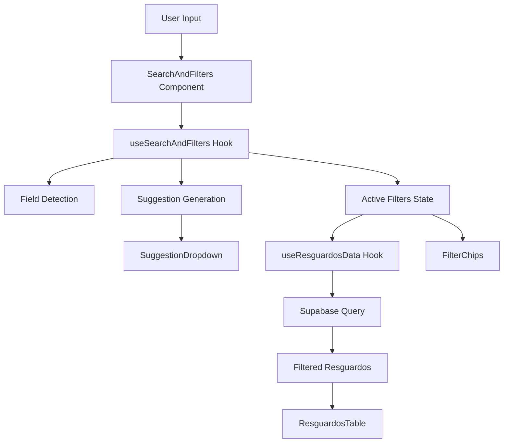

# Design Document: Unified Search for Consultar Resguardos

## Overview

This design document describes the refactoring of the search functionality in Consultar Resguardos to adopt the unified search pattern from Crear Resguardos. The refactoring will consolidate the separate SearchBar and AdvancedFilters components into a single intelligent search interface with smart suggestions, filter chips, and field-type detection.

The unified search pattern provides several advantages:
- Single input field reduces cognitive load
- Smart field detection eliminates the need to select filter types manually
- Visual filter chips provide clear feedback on active filters
- Keyboard navigation enables efficient power-user workflows
- Consistent UX across the application

## Architecture

### Component Structure

The refactored architecture will follow this structure:

```
src/components/resguardos/consultar/
├── index.tsx                          # Main orchestrator (updated)
├── components/
│   ├── SearchAndFilters.tsx          # NEW: Unified search component
│   ├── FilterChips.tsx               # NEW: Filter chips display
│   ├── SuggestionDropdown.tsx        # NEW: Autocomplete suggestions
│   ├── SearchBar.tsx                 # REMOVED
│   ├── AdvancedFilters.tsx           # REMOVED
│   └── ... (other components unchanged)
├── hooks/
│   ├── useSearchAndFilters.ts        # NEW: Search state management
│   ├── useResguardosData.ts          # UPDATED: Integrate with new filters
│   └── ... (other hooks unchanged)
└── types.ts                           # UPDATED: Add filter types
```

### Data Flow



### State Management

The unified search introduces new state managed by the `useSearchAndFilters` hook:

1. **Search Term**: Current text in the search input
2. **Deferred Search Term**: Debounced version for performance
3. **Search Match Type**: Detected field type (folio, director, resguardante, fecha)
4. **Active Filters**: Array of applied filters with type and value
5. **Suggestions**: Array of autocomplete suggestions
6. **UI State**: Dropdown visibility, highlighted index

The `useResguardosData` hook will be updated to consume active filters instead of individual filter states.

## Components and Interfaces

### SearchAndFilters Component

**Purpose**: Main search input with integrated suggestions and filter chips

**Props**:
```typescript
interface SearchAndFiltersProps {
  searchTerm: string;
  onSearchChange: (term: string) => void;
  suggestions: Suggestion[];
  showSuggestions: boolean;
  highlightedIndex: number;
  onSuggestionClick: (index: number) => void;
  onKeyDown: (e: React.KeyboardEvent<HTMLInputElement>) => void;
  onBlur: () => void;
  searchMatchType: SearchMatchType | null;
  inputRef: RefObject<HTMLInputElement | null>;
  onShowSuggestionsChange: (show: boolean) => void;
  onHighlightChange: (index: number) => void;
  totalRecords?: number;
  activeFilters?: ActiveFilter[];
  onRemoveFilter?: (index: number) => void;
}
```

**Behavior**:
- Renders search input with icon
- Displays field type badge when detected
- Shows filter chips below input
- Integrates SuggestionDropdown
- Handles focus/blur events

### FilterChips Component

**Purpose**: Display active filters as removable chips

**Props**:
```typescript
interface FilterChipsProps {
  filters: ActiveFilter[];
  onRemoveFilter: (index: number) => void;
}
```

**Behavior**:
- Renders each filter as an animated chip
- Shows filter type label and value
- Provides remove button for each chip
- Animates chip addition/removal using Framer Motion

### SuggestionDropdown Component

**Purpose**: Display autocomplete suggestions with keyboard navigation

**Props**:
```typescript
interface SuggestionDropdownProps {
  suggestions: Suggestion[];
  highlightedIndex: number;
  onSuggestionClick: (index: number) => void;
  onHighlightChange: (index: number) => void;
  isDarkMode: boolean;
}
```

**Behavior**:
- Renders suggestions with icons based on type
- Highlights selected suggestion
- Handles mouse hover and click events
- Provides visual feedback for field types

### useSearchAndFilters Hook

**Purpose**: Manage search state, field detection, and suggestions

**Return Type**:
```typescript
interface UseSearchAndFiltersReturn {
  searchTerm: string;
  setSearchTerm: (value: string) => void;
  deferredSearchTerm: string;
  searchMatchType: SearchMatchType | null;
  activeFilters: ActiveFilter[];
  addFilter: (filter: ActiveFilter) => void;
  removeFilter: (index: number) => void;
  suggestions: Suggestion[];
  showSuggestions: boolean;
  setShowSuggestions: (show: boolean) => void;
  highlightedIndex: number;
  setHighlightedIndex: (index: number) => void;
  handleKeyDown: (e: React.KeyboardEvent) => void;
  handleBlur: () => void;
  saveCurrentFilter: () => void;
}
```

**Behavior**:
- Detects field type based on search term matches
- Generates suggestions from dataset
- Manages active filters array
- Handles keyboard navigation
- Debounces search term updates

## Data Models

### ActiveFilter

Represents a single active filter:

```typescript
interface ActiveFilter {
  term: string;                    // Filter value
  type: SearchMatchType | null;    // Field type
}
```

### Suggestion

Represents an autocomplete suggestion:

```typescript
interface Suggestion {
  value: string;                   // Suggestion text
  type: SearchMatchType | null;    // Field type
}
```

### SearchMatchType

Enum of searchable field types:

```typescript
type SearchMatchType = 
  | 'folio' 
  | 'director' 
  | 'resguardante' 
  | 'fecha' 
  | null;
```

### Updated Resguardo Type

The existing Resguardo type remains unchanged:

```typescript
interface Resguardo {
  folio: string;
  fecha: string;
  director: string;
  resguardantes: string;  // Comma-separated
}
```

## Field Detection Algorithm

The field detection algorithm prioritizes matches based on exactness and field importance:

1. **Exact Match Priority**: Exact matches score higher than partial matches
2. **Field Priority Order**: 
   - Director (score: 6 exact, 5 partial)
   - Folio (score: 5 exact, 4 partial)
   - Resguardante (score: 4 exact, 3 partial)
   - Fecha (score: 3 exact, 2 partial)

**Algorithm**:
```
For each resguardo in dataset:
  For each field in priority order:
    If field value matches search term:
      Calculate score (exact = +1, partial = base)
      If score > current best score:
        Update best match
Return best match type
```

## Suggestion Generation Algorithm

The suggestion generation algorithm creates autocomplete options:

1. **Minimum Length**: Require at least 2 characters
2. **Field Scanning**: Check all fields (folio, director, resguardante, fecha)
3. **Deduplication**: Use Set to avoid duplicate suggestions
4. **Limit**: Maximum 7 suggestions
5. **Sorting**: Prioritize suggestions starting with search term

**Algorithm**:
```
If search term length < 2:
  Return empty suggestions

Initialize seen Set and suggestions array
For each field type:
  For each unique value in field:
    If value contains search term:
      If not in seen Set:
        Add to suggestions
        Add to seen Set
        If suggestions.length >= 7:
          Break

Sort suggestions (startsWith before contains)
Return suggestions
```

## Integration with useResguardosData

The `useResguardosData` hook will be updated to accept active filters:

**Current Interface**:
```typescript
// Individual filter states
searchTerm: string;
startDate: string;
selectedDirector: string;
selectedResguardante: string;
```

**New Interface**:
```typescript
// Unified filter array
activeFilters: ActiveFilter[];
```

**Query Building**:
```typescript
For each filter in activeFilters:
  Switch on filter.type:
    Case 'folio':
      query = query.ilike('folio', `%${filter.term}%`)
    Case 'director':
      query = query.or(`directorio.nombre.ilike.%${filter.term}%`)
    Case 'resguardante':
      query = query.ilike('resguardante', `%${filter.term}%`)
    Case 'fecha':
      query = query.eq('f_resguardo::date', filter.term)
```


## Correctness Properties

A property is a characteristic or behavior that should hold true across all valid executions of a system—essentially, a formal statement about what the system should do. Properties serve as the bridge between human-readable specifications and machine-verifiable correctness guarantees.

### Property 1: Field Detection Accuracy

*For any* search term and dataset, when the search term matches values in the dataset, the detected field type should correspond to the field with the highest match score (exact matches score higher than partial matches, and fields are prioritized: director > folio > resguardante > fecha).

**Validates: Requirements 1.1, 1.2**

### Property 2: Field Type Indicator Display

*For any* detected field type (folio, director, resguardante, fecha), when searchMatchType is not null, the SearchAndFilters component should render a visual badge displaying the field type label.

**Validates: Requirements 1.3**

### Property 3: Suggestion Minimum Length

*For any* search term, suggestions should only be displayed when the search term length is greater than or equal to 2 characters.

**Validates: Requirements 1.5**

### Property 4: Suggestion Limit and Deduplication

*For any* search term and dataset, the suggestions array should contain at most 7 unique suggestions (no duplicate values).

**Validates: Requirements 2.1, 7.1, 7.4, 9.2**

### Property 5: Suggestion Structure Completeness

*For any* suggestion in the suggestions array, the suggestion object should contain both a value field (string) and a type field (SearchMatchType).

**Validates: Requirements 2.2**

### Property 6: Suggestion Hover Highlighting

*For any* suggestion in the dropdown, when a mouse hover event occurs on that suggestion, the highlightedIndex should update to match that suggestion's index.

**Validates: Requirements 2.3**

### Property 7: Suggestion Selection Behavior

*For any* suggestion, when clicked, the system should add the suggestion to activeFilters with the correct type and value, and clear the searchTerm to an empty string.

**Validates: Requirements 2.4**

### Property 8: Suggestion Sorting Priority

*For any* suggestions array, suggestions where the value starts with the search term should appear before suggestions where the value only contains the search term.

**Validates: Requirements 2.5**

### Property 9: Empty Suggestions Visibility

*For any* state where suggestions.length equals 0, showSuggestions should be false (dropdown not displayed).

**Validates: Requirements 2.6**

### Property 10: Keyboard Navigation

*For any* visible suggestion dropdown with N suggestions, pressing ArrowDown should increment highlightedIndex modulo N, and pressing ArrowUp should decrement highlightedIndex modulo N (with wrap-around).

**Validates: Requirements 3.1, 3.2, 3.5, 3.6**

### Property 11: Keyboard Selection

*For any* highlighted suggestion (highlightedIndex >= 0), pressing Enter should add that suggestion to activeFilters and clear the search input.

**Validates: Requirements 3.3**

### Property 12: Keyboard Dismissal

*For any* visible suggestion dropdown, pressing Escape should set showSuggestions to false.

**Validates: Requirements 3.4**

### Property 13: Filter Chip Display

*For any* filter in activeFilters, a corresponding FilterChip component should be rendered displaying both the filter type label and the filter term value.

**Validates: Requirements 4.1, 4.2**

### Property 14: Filter Chip Removal

*For any* filter chip at index I, clicking the remove button should remove the filter at index I from the activeFilters array.

**Validates: Requirements 4.3**

### Property 15: Filter Chip Ordering

*For any* activeFilters array, the rendered filter chips should appear in the same order as the filters in the array.

**Validates: Requirements 4.6**

### Property 16: Multi-Filter AND Logic

*For any* set of active filters, the filtered resguardos should satisfy all filter conditions simultaneously (AND logic, not OR).

**Validates: Requirements 5.1**

### Property 17: Filter Type Matching

*For any* active filter with type T and term V:
- If T is 'folio', filtered resguardos should have folio containing V
- If T is 'director', filtered resguardos should have director containing V
- If T is 'resguardante', filtered resguardos should have resguardante containing V
- If T is 'fecha', filtered resguardos should have fecha equal to V

**Validates: Requirements 5.2, 5.3, 5.4, 5.5, 10.2, 10.3, 10.4, 10.5**

### Property 18: Empty Filter Identity

*For any* dataset, when activeFilters is empty, the filtered result should equal the complete dataset (no filtering applied).

**Validates: Requirements 5.6**

### Property 19: Suggestion Field Coverage

*For any* search term with length >= 2, the suggestions should include matches from all searchable fields (folio, director, resguardante, fecha) where matches exist in the dataset.

**Validates: Requirements 7.2**

### Property 20: Suggestion Reactivity

*For any* change to the resguardos dataset, the available suggestions should update to reflect the new dataset values.

**Validates: Requirements 7.3**

### Property 21: Director Value Type Handling

*For any* resguardo where director is either a relational object {nombre: string} or a string, the suggestion extraction should correctly extract the director name as a string.

**Validates: Requirements 7.5**

### Property 22: Theme Context Integration

*For any* theme change (dark mode to light mode or vice versa), the SearchAndFilters component should update its styling to match the new theme.

**Validates: Requirements 8.1**

### Property 23: Search Term Debouncing

*For any* rapid sequence of search term changes, the deferred search term should only update after the user stops typing (debounced behavior).

**Validates: Requirements 9.1**

### Property 24: Suggestion Recalculation Optimization

*For any* state change that doesn't affect searchTerm or the dataset, suggestions should not be recalculated.

**Validates: Requirements 9.4**

### Property 25: Filter Operation Rate Limiting

*For any* rapid sequence of typing events, only one filter operation should be in progress at a time (no simultaneous filter operations).

**Validates: Requirements 9.5**

### Property 26: Backward Compatibility Preservation

*For any* existing functionality (sorting, pagination, details view, refresh, clear), the functionality should continue to work identically after the refactoring.

**Validates: Requirements 6.4, 6.6, 10.6**

## Error Handling

### Input Validation

- **Empty Search Terms**: The system should handle empty search terms gracefully by hiding suggestions and not triggering field detection
- **Invalid Field Types**: If a filter has a null or invalid type, it should be ignored in query building
- **Malformed Data**: If resguardo data is missing required fields, the system should skip those records in suggestion generation

### Edge Cases

- **No Matches**: When no resguardos match the active filters, display an empty state message
- **Single Suggestion**: When only one suggestion exists, keyboard navigation should still work (wrapping to itself)
- **Rapid Filter Changes**: Debouncing prevents race conditions from rapid filter additions/removals
- **Dataset Loading**: While data is loading, suggestions should be empty and field detection should be disabled

### Error Recovery

- **Query Failures**: If a Supabase query fails, display an error message and allow retry
- **Invalid Filter Values**: Sanitize filter values to prevent SQL injection (use parameterized queries)
- **State Inconsistencies**: If activeFilters and displayed chips become out of sync, re-render from activeFilters as source of truth

## Testing Strategy

### Dual Testing Approach

This feature requires both unit tests and property-based tests for comprehensive coverage:

- **Unit tests**: Verify specific examples, edge cases, and error conditions
- **Property tests**: Verify universal properties across all inputs

### Unit Testing Focus

Unit tests should cover:
- Specific examples of field detection (e.g., "FOL-001" detects as folio)
- Edge cases like empty search, single character input, special characters
- Error conditions like network failures, malformed data
- Integration between components (SearchAndFilters → useSearchAndFilters → useResguardosData)
- UI interactions like clicking chips, hovering suggestions

### Property-Based Testing

Property tests should be implemented using a property-based testing library (e.g., fast-check for TypeScript). Each test should:
- Run a minimum of 100 iterations
- Reference the design document property number
- Use the tag format: **Feature: resguardos-consultar-unified-search, Property N: [property text]**

**Example Property Test Structure**:
```typescript
// Feature: resguardos-consultar-unified-search, Property 4: Suggestion Limit and Deduplication
test('suggestions should contain at most 7 unique values', () => {
  fc.assert(
    fc.property(
      fc.array(fc.record({
        folio: fc.string(),
        director: fc.string(),
        resguardante: fc.string(),
        fecha: fc.string()
      })),
      fc.string({ minLength: 2 }),
      (dataset, searchTerm) => {
        const suggestions = generateSuggestions(dataset, searchTerm);
        expect(suggestions.length).toBeLessThanOrEqual(7);
        const uniqueValues = new Set(suggestions.map(s => s.value));
        expect(uniqueValues.size).toBe(suggestions.length);
      }
    ),
    { numRuns: 100 }
  );
});
```

### Testing Coverage

Each correctness property (1-26) should have a corresponding property-based test. Additionally, unit tests should cover:
- Component rendering with various prop combinations
- Hook state transitions
- Query building logic
- Keyboard event handling
- Mouse event handling
- Animation triggers (not animation quality)

### Integration Testing

Integration tests should verify:
- Complete user flows (search → select suggestion → view filtered results)
- Component communication (SearchAndFilters → index.tsx → ResguardosTable)
- Data flow (user input → hook state → Supabase query → rendered results)
- Backward compatibility (existing features still work after refactoring)
