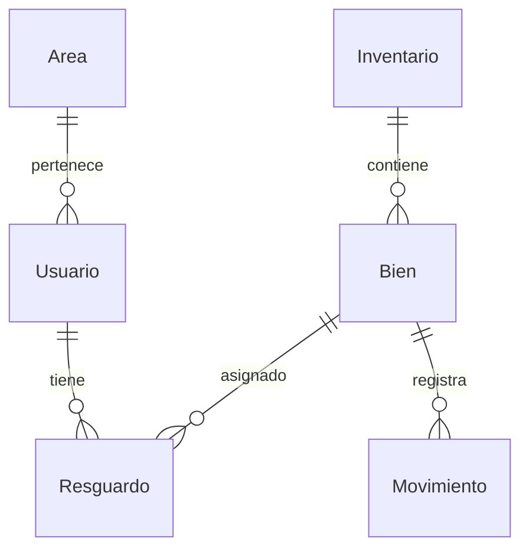

# Sistema de Gestión de Inventarios

  
  
  

Aplicación web moderna para la gestión de inventarios de bienes muebles en dependencias gubernamentales, desarrollada con Next.js y TypeScript. Diseño minimalista en blanco y negro con enfoque en usabilidad y accesibilidad.

---

## 🚀 Características principales

### 📦 Módulos funcionales
- **Inventario**: Registro y gestión de bienes (ACTIVO/INACTIVO/OBSOLETO).
- **Resguardos**: Asignación, verificación y liberación de bienes con firmas digitales.
- **Consultas**: Búsqueda avanzada con filtros y exportación a PDF/Excel.
- **Reportes**: Generación automatizada de reportes analíticos.
- **Administración**: CRUD de usuarios, áreas y permisos.

### 🔒 Seguridad
- Autenticación con NextAuth.js y roles (Admin, Inventarista, Consultor).
- Validación de datos con Zod en cliente/servidor.
- Historial completo de acciones para auditoría.

### 📱 Diseño
- Interfaz B&W de alto contraste (WCAG 2.1 AA).
- Componentes accesibles (Radix UI/Shadcn).
- Responsive (mobile-first para trabajo en campo).

---

## 🛠 Stack tecnológico

| Área          | Tecnologías                                                                 |
|---------------|-----------------------------------------------------------------------------|
| Frontend      | Next.js 14+, TypeScript, Tailwind CSS                                      |
| Estado        | React Context API, SWR (caché/stale-while-revalidate)                      |
| Backend       | Next.js API Routes, Prisma ORM, PostgreSQL                                 |
| UI            | Radix UI, Shadcn/UI, recharts (gráficos), react-pdf (reportes)             |
| Utilidades    | Zod (validación), react-hook-form (formularios)                            |

---

## 🗂 Estructura de directorios

```bash
/src
├── app               # Next.js App Router
├── components        # Componentes reutilizables
│   ├── ui           # Componentes básicos (botones, cards)
│   ├── tables       # Tablas con filtrado/ordenación
│   └── modals       # Ventanas modales
├── lib               # Utilidades (hooks, contextos, tipos TS)
├── prisma           # Modelos de DB y cliente Prisma
└── public           # Assets estáticos
```

---

## 📊 Modelo de datos clave



---

## 📅 Plan de desarrollo

| Fase           | Duración   | Entregables                                  |
|----------------|------------|----------------------------------------------|
| Fundamentos    | 2-3 semanas| Auth, modelo DB, diseño base                 |
| Módulos básicos| 3-4 semanas| Inventario, Consultas, Resguardos            |
| Avanzado       | 3-4 semanas| Reportes, Dashboard, trazabilidad            |
| Refinamiento   | 2-3 semanas| Optimización, pruebas, documentación         |

---

## 🚧 Requisitos

- Node.js 18+
- PostgreSQL 15+
- PNPM (recomendado)

---

## 🔧 Instalación

```bash
pnpm install
pnpm prisma migrate dev  # Configura DB
pnpm dev                # Inicia servidor de desarrollo
```

---

## 📌 Roadmap futuro
- 📱 App móvil para inventarios en campo.
- 📊 Integración con sistemas gubernamentales.
- 🤖 Módulo de predicción de obsolescencia.

---

## 📄 Licencia
Proyecto desarrollado para uso gubernamental (licencia interna).
``` 

> **Nota**: Este README.md incluye badges dinámicos, diagramas Mermaid (compatible con GitHub/Markdown viewers) y estructura visual clara. Ajusta las tecnologías o fases según necesidades específicas.